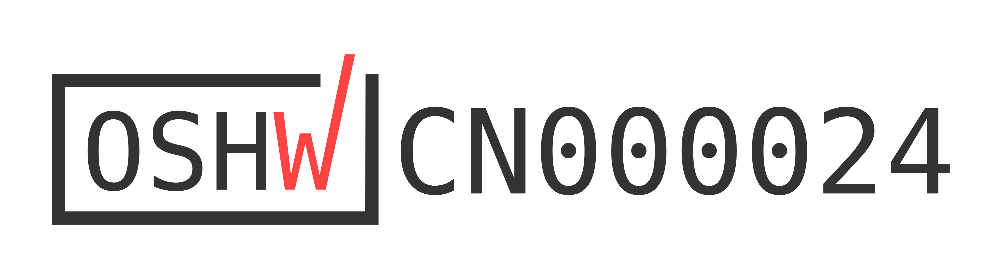

# 🦾 reBot-DevArm: Open Source Robotic Arm for All Developers

  

    

    
    
    </a>
    
    
    
    

  <strong>🚀 100% Open Source · Embodied AI · Full Hardware + Software Stack</strong>

  <strong>📦 Build your own robotic arm · 🧠 Learn robotics · 🏭 Deploy real applications</strong>

<table align="center">
  <tr>
    <td>
      
    </td>
    <td>
      <a href="https://www.youtube.com/watch?v=ONbpv3seiG8">
        About The reBot Arm
      </a>
    </td>
  </tr>
</table>

  <strong>
    <a href="./README_zh.md">简体中文</a> &nbsp;|&nbsp;
    <a href="./README.md">English</a> &nbsp;|&nbsp;
    <a href="./README_JP.md">日本語</a>&nbsp;|&nbsp;
    <a href="./README_Fr.md">français</a>&nbsp;|&nbsp;
    <a href="./README_es.md">Español</a>
  </strong>

<a href="https://wiki.seeedstudio.com/robotics_page/">  
    </a>

## 📖 Introduction

**reBot-DevArm (reBot Arm B601 DM and reBot Arm B601 RS)** is a robotic arm project dedicated to lowering the barrier to learning Embodied AI. We focus on **"True Open Source"** — not just the code, we unreservedly open source everything:
- 🦾 **Two versions of the robotic arm**：We will provide all open-source files for two versions of the robotic arm with the same appearance: **Robostride** and **Damiao**.
- 🛠️ **Hardware Blueprints**: Source files for sheet metal parts and 3D printed parts.
- 🔩 **BOM List**: Detailed down to the specifications and purchase links for every single screw.
- 💻 **Software & Algorithms**: Python SDK, ROS1/2, Isaac Sim, LeRobot, etc.

## Get Your Own reBot Arm

- We offer five kit options  at  [Seeedstudio.com](https://www.seeedstudio.com/reBot-Arm-B601-DM-Bundle.html) :
  - **Arm Body Motor Kit**: Includes only motors and wiring harnesses for the robotic arm.
  - **Arm Body Structural Kit**: Includes only mechanical structural components.
  - **Gripper Complete Kit**: Includes motors, wiring harnesses and structural components for the gripper.
  - **Full Kit**: Includes the complete set of the robotic arm body and gripper.
  - **Pre‑assembled Robotic Arm**: Fully assembled finished robotic arm.

- The Seeedstudio kit does not include a power adapter and C-clamps as standard accessories. This arrangement takes into account that users may power the unit via batteries or mount it with a custom DIY base. You may purchase a [power supply separately](https://www.seeedstudio.com/AC-DC-Power-Adapter-IEC-60320-C14-XT30-Female-24V-4-5A-1200mm-L190-W92-5-H36mm-p-6764.html) and [Power Cord](https://www.seeedstudio.com/reServer-AC-US-p-5052.html), or refer to the Mean Well power solution shown at the bottom of our [BOM](./hardware/reBot_B601_DM/readme.md/#about-power-supply).

- You can also purchase the [Leader Arm](https://www.seeedstudio.com/Star-Arm-102-p-6765.html?qid=P2U7IG_yskyak5m_1776415593315) and [12V 10A Power Supply](https://www.seeedstudio.com/FY1209900-12V-10A-Power-Adapter-12V-10A-p-6496.html) You may also use the 12VDC power adapter of SO-ARM101 to supply power to the Leader.

-------------------
- For reBot Arm RS Version, We offer five kit options  at  [Seeedstudio.com](https://www.seeedstudio.com/reBot-Arm-B601-RS-Assembled-Kit-with-Gripper-p-6865.html) :
  - **Full Kit**: Includes the unassembled complete set of the robotic arm body and gripper.
  - **Pre‑assembled Robotic Arm**: Fully assembled finished robotic arm.

- We highly recommend using the [Meanwell 48V 12.5A](https://www.amazon.com/sspa/click?ie=UTF8&spc=MTo0NzgzODk2NzUxNTQ0NzEyOjE3ODE2MTA2NTU6c3BfYXRmOjIwMDExNjA5NjQwMTc5ODo6MDo6&url=%2FLRS-350-48-Price-Switching-Supply-MeanWell%2Fdp%2FB0BP6S5DYR%2Fref%3Dsr_1_1_sspa%3Fcrid%3D27VPQOWNPN9UG%26dib%3DeyJ2IjoiMSJ9.qK84sGJa4-74kbCEX11MOFBju8sSQUdFsbHw6PNvmaEHnhzjX2T7dyhRNJY01mXxpWk8lccGOwnezxmqLKUjqglX_FI26mrxlvZf0KNiLdJ8QnhKsber4KDoyyLHNxWGV451uHCzZbCDXxM0iYXVnubuVourRaRURlyMorRavuLd2a32kABx-BKqyF5Dfr7dV453ecE6QULFqG-UVLBaBRijbxQGTJ2YiNyXAqn3bkM.Bt5mAPOJNAWGnXCC2mwvjdDdccZd1_0-WRXZpP4mR4M%26dib_tag%3Dse%26keywords%3DLRS-350-48%26qid%3D1781610655%26sprefix%3Dlrs-350-%252Caps%252C331%26sr%3D8-1-spons%26sp_csd%3Dd2lkZ2V0TmFtZT1zcF9hdGY%26psc%3D1) power supply for the RS model. If you need stronger power to unlock its full performance, you may opt for a 48V 25A power adapter.
------------------

## 🗺️ Roadmap & Status

We are committed to continuously maintaining and adapting to mainstream robot development ecosystems. Below is our current adaptation progress and planned release schedule:

### reBot Arm B601 DM
| Supported Ecosystem | Status | Description / Estimated Release Date | Related Documentation |
| :--- | :---: | :--- | :--- |
| **Basic Motor Usage** | ✅ Completed | Basic motion control and API encapsulation | [Damiao Technology](https://wiki.seeedstudio.com/cn/damiao_series/) |
| **Open-Sourcing of the New STEP 3D Structural Parts and BOM** | ✅ Completed | STEP files for all parts in the new version, parts BOM, and reference prices for all machined components | [reBot Arm B601-DM BOM](./hardware/reBot_B601_DM/readme.md) |
| **Reference for Real Machine Performance Testing** | ✅ Completed   | Performance Reference of Robotic Arm under Normal and Extreme Operating Conditions |[Performance Testing](./hardware/reBot_B601_DM/performance_testing/Performance_Testing.md) |
| **Assembly Video** | ✅ Completed | Ultra-detailed assembly steps and video | [Getting Started with reBot Arm B601-DM](https://wiki.seeedstudio.com/rebot_b601_dm_getting_started/) |
| **Python SDK** | ✅Continuously optimized, PRs welcome | One-stop integration of motor read/write and control for Robstride, Damiao, Mota, Gaoqing, Hexfellow and other motors. | [Getting Started with Motorbridge](https://motorbridge.seeedstudio.com) and [Web UI](https://rebot-devarm.w0x7ce.eu/)|
| **ROS2 Integration** | ✅ Completed | ROS2 integrated reBot Arm controller with support for kinematics, trajectory planning, and gravity compensation | [reBot Arm B601-DM ROS2 Integration Guide](https://wiki.seeedstudio.com/rebot_arm_b601_dm_ros2_integration/) |
| **Pinocchio Integration** |  ✅ Completed  | Adaptation to the Pinocchio framework, enabling forward/inverse kinematics and gravity compensation for the robotic arm | [Getting Started with Pinocchio for reBot Arm B601-DM](https://wiki.seeedstudio.com/rebot_arm_b601_dm_pinocchio_meshcat/) and [Github repo](https://github.com/vectorBH6/reBotArm_control_py) |
| **Isaac Sim Simulation** | 🚧 In Progress  | Import USD models and enable simulated teleoperation | [delay for add additional courses: 2026.06.20] |
| **LeRobot Integration** | ✅ Completed  | Adaptation to the Hugging Face LeRobot training framework | [Getting Started with LeRobot-based reBot Arm](https://wiki.seeedstudio.com/rebot_arm_b601_dm_lerobot/) |
| **Depth Camera Integration** | ✅ Completed  | Visual Grasping Demonstration Based on YOLO and Depth Camera | [Getting Started with Visual Grasping Demo](https://wiki.seeedstudio.com/rebot_arm_b601_dm_grasping_demo/) |
| **reSpeaker Voice Integration** | ✅ Completed  | Add reSpeaker Flex 4-mic array to build a voice-driven intelligent robot arm control system with spatial awareness | [reBot Arm B601-DM Voice Control](https://wiki.seeedstudio.com/control_rebot_arm_using_voice_with_respeaker_flex/) |
| **Gradual Updates of the Latest Algorithms** | ⏳ Planned | Mainstream algorithms will be updated progressively | Ongoing |
| **Launch of a Series of Completely Free Courses** | ⏳ Planned | Mainstream algorithms will be updated progressively | Ongoing |

#### Contributions from Developers 
| Supported Ecosystem | Authors | Description / Estimated Release Date | Related Documentation or Repository |
| :--- | :---: | :--- | :--- |
| **ROS2 (Humble), third_party integration, URDF / rebotarm_bringup** | [@danieldoradotalaveron-rb](https://github.com/danieldoradotalaveron-rb) | 1. **Passive diagnostics monitor** (`rebotarm_monitor_ros2`): `/diagnostics` overlay for `rqt_robot_monitor`, serial/CAN-aware aggregator; 2. **Safe park & shutdown**: Capture rest pose on connect, slow return on shutdown or `/rebotarm/park` to prevent sudden drop; 3. **Gravity compensation (smooth stop)**: MIT ramp-out when exiting gravity compensation to eliminate clack, jerk and instability during pos/vel handoff; 4. **Gamepad teleop with IK/FK and safety measures**: Gamepad control for end-effector via IK, live robot state visualization in RViz (simulation-only test); 5. **D405 eye-in-hand TF**: Xacro setup under `end_link` in `rebotarm_bringup` for RViz visualization & TF only (no driver/depth/intrinsics). Mount pose adjustable via launch file, bracket calibration not completed. Teleop FK/IK uses arm-only `fixend_core` URDF, full xacro for RSP/RViz. | [rebotarm_monitor_ros2](https://github.com/danieldoradotalaveron-rb/rebotarm_monitor_ros2)、[reBotArmController_ROS2](https://github.com/danieldoradotalaveron-rb/reBotArmController_ROS2) |

### reBot Arm B601 RS

| Supported Ecosystem | Status | Description / Estimated Release Date | Related Documentation |
| :--- | :---: | :--- | :--- |
| **Basic Motor Usage** | ✅ Completed | Basic motion control and API encapsulation | [Robstride](https://wiki.seeedstudio.com/cn/robstride_control/) |
| **Open-Sourcing of the New STEP 3D Structural Parts and BOM** | 🚧 In Progress | STEP files for all parts in the new version, parts BOM, and reference prices for all machined components | Expected [2026.06] |
|**Getting Started**| ✅ Completed | Quick start of B601-RS| [Getting Started with reBot Arm B601-RS](https://wiki.seeedstudio.com/rebot_b601_rs_getting_started/) |
| **Assembly Video** | 🚧 In Progress | Ultra-detailed assembly steps and video | [Expected 2026.06] |
| **ROS2 (Humble)** | ✅ Completed | ROS2 integrated reBot Arm controller with support for kinematics, trajectory planning, gravity compensation and MoveIt2 | [reBot Arm B601-DM ROS2 Integration Guide](https://wiki.seeedstudio.com/rebot_arm_b601_rs_ros2_integration/) |
| **LeRobot Integration** |✅ Completed| Adaptation to the Hugging Face LeRobot training framework | [Getting Started with LeRobot-based reBot Arm](https://wiki.seeedstudio.com/rebot_arm_b601_rs_lerobot/) |
| **Pinocchio Integration** | ✅ Completed | Adaptation to the Pinocchio framework, enabling forward/inverse kinematics and gravity compensation for the robotic arm | [Getting Started with Pinocchio for reBot Arm B601-DM](https://wiki.seeedstudio.com/rebot_arm_b601_rs_pinocchio_meshcat/) and [Github repo](https://wiki.seeedstudio.com/rebot_arm_b601_rs_grasping_demo/) |
| **Depth Camera Integration** | ✅ Completed  | Visual Grasping Demonstration Based on YOLO and Depth Camera | [Getting Started with Visual Grasping Demo](https://wiki.seeedstudio.com/rebot_arm_b601_dm_grasping_demo/) |
| **Isaac Sim Simulation** | ⏳ Planned | Import USD models and enable simulated teleoperation | Ongoing |
| **Gradual Updates of the Latest Algorithms** | ⏳ Planned | Mainstream algorithms will be updated progressively | On going |
| **Launch of a Series of Completely Free Courses** | ⏳ Planned | Mainstream algorithms will be updated progressively | Ongoing |

---

## ⚙️ Hardware Specifications

reBot-DevArm is designed for desktop Embodied AI applications, balancing payload capacity with flexibility.

| Parameter | reBot Arm B601-DM | reBot Arm B601-RS|
| :--- | :--- | :--- |
| **Payload** | 1.5kg | **2.5kg** |
| **Recommended Workspace** | 70% arm reach workspace | 70% arm reach workspace |
| **Max Reach** | 767 mm | **754 mm** |
| **Weight** | **Approx. 4.5 kg** | Approx. 6.7 kg |
| **Repeatability** | < 0.2 mm | < 0.2 mm |
| **Degrees of Freedom (DOF)** | 6 DOF + 1 Gripper | 6 DOF + 1 Gripper |
| **Supported Platforms/Ecosystems** | ROS1, ROS2, LeRobot, Pinocchio, Isaac Sim, Python SDK | ROS1, ROS2, LeRobot, Pinocchio, Isaac Sim, Python SDK |
| **Supply Voltage** | DC 24V | DC 48V |

## Feedback from the community
|  |    |  |  | |
| --- | --- | --- | --- |  --- | 
| [From GEM-4: Gemma Embodied 4 Physical Assistance](https://www.kaggle.com/competitions/gemma-4-good-hackathon/writeups/new-writeup-1778618527713) | [From Linyan Fu](https://x.com/Linyan_Fu/status/2056383947341525180)  and [Apheth D Almeida](https://x.com/Apheth_DAlmeida/status/2053503164507476096)| [From Dhruv Diddi](https://x.com/DhruvDiddi/status/2046605015008383284)  | [From Ed Henderson](https://x.com/ed0henderson/status/2055076839002095743)  | From Sameer | 
|  |    |  |  | |
| [From Binh_Pham](https://x.com/pham_blnh/status/2061994096374505710) | [From FangTianChongHui](https://www.instagram.com/reel/DY7Ny8OPjVu/?utm_source=ig_web_copy_link&igsh=NTc4MTIwNjQ2YQ==)| [Xense YaoLin Dong](https://x.com/dong1505lin)  | [From Ed Henderson](https://x.com/ed0henderson/status/2055076839002095743)  | | 

## 🧹Optional Hardware
###  Wirst Camera Mount
| 32×32 UVC  | Intel D435i | Intel D405 & Gemini 305 | Gemini 2|
| --- | --- | --- | --- | 
|  |  |   |  | 
| [STEP](/hardware/reBot_B601_DM/3D_Printed_Parts/UVC32_mount.step) | [STEP](/hardware/reBot_B601_DM/3D_Printed_Parts/D435_Gemini2_Mount.step) | [STEP](/hardware/reBot_B601_DM/3D_Printed_Parts/D405_305_Mount.step) |[STEP](/hardware/reBot_B601_DM/3D_Printed_Parts/D435_Gemini2_Mount.step) |

###  Compatible with Leader Arm
| Star Arm 102-LD  |  Open to compatibility integration  | 
| --- | --- |
|    |Comming soon| 
|  [Github repo](https://github.com/servodevelop/Star-Arm-102) |Comming soon |

### DIY Finger
| Soft Finger  |  Open to compatibility integration  | 
| --- | --- |
|    |Comming soon| 
| [Finger Mount(ABS/PLA)](/hardware/reBot_B601_DM/3D_Printed_Parts/Soft_Gripper_Mount.step) and [Finger (TPU 95+)](/hardware/reBot_B601_DM/3D_Printed_Parts/Soft_Gripper_Finger.step)  |Coming soon |

---

### 🎓 Full-Stack Robotics Ecosystem
reBot-DevArm is not just a robotic arm, but a robotics learning community. We share the following general tutorials for free:

#### 🖥️ Edge Computing & Master Control
*    —— **AI Inference & Compute Core**
*    —— **General Linux Development Environment**
*   [-0091BD?style=for-the-badge&logo=espressif&logoColor=white)](https://wiki.seeedstudio.com/SeeedStudio_XIAO_Series_Introduction/) —— **Low-power Wireless Control Node**

#### 📡 Sensors & Peripherals
*   **🚗 Motors & Servos**: [Damiao / Gogo / Robstride / Mita / Feite / Fashion Star](https://wiki.seeedstudio.com/robotics_page/)
*   **👁️ Visual Perception**: [Depth Cameras / LiDAR / Vision Algorithms](https://wiki.seeedstudio.com/robotics_page/)
*   **👂 Voice Interaction**: [reSpeaker Mic Arrays/Voice Control/Spatial Awareness(DoA)](https://wiki.seeedstudio.com/control_rebot_arm_using_voice_with_respeaker_flex/)
*   **🧭 Motion & Attitude**: [IMU (6-axis/9-axis) / Gyroscopes / Magnetometers](https://wiki.seeedstudio.com/Sensor/IMU/)
*   **🤖 Comprehensive Kits**: [More Robotics Sensors & Driver Examples](https://wiki.seeedstudio.com/robotics_page/)

> 👉 **[Click to Enter Wiki Knowledge Base](https://wiki.seeedstudio.com/)** (All tutorials are free to view)

---

## 🙌 References & Acknowledgments
The path of open source is never lonely. The birth of the reBot-DevArm project would not be possible without the full support of Seeed Studio, the global open source community, and excellent hardware partners. We pay our highest respects to the following projects and teams:

### 🌍 Ecosystem & Software Support
*   **[Seeed Studio](https://www.seeedstudio.com/)** - Providing comprehensive hardware supply chain and technical support.
*   **[Hugging Face LeRobot](https://github.com/huggingface/lerobot)** - An excellent end-to-end robot learning framework.
*   **[NVIDIA Isaac Sim](https://developer.nvidia.com/isaac/sim)** - A powerful robot simulation and synthetic data platform.

### ⚙️ Core Hardware Partners
Thanks to the following manufacturers for providing high-performance motor and actuator solutions:
*   **[Damiao Technology](https://www.damiaokeji.com/)**
*   **[Robstride](https://robstride.com/)**
*   **[Fashion Star](https://fashionstar.com.hk/wiki/)**

### 💡 Inspiration
This project is deeply inspired by the following excellent open source projects:
*   **[SO-ARM100](https://github.com/TheRobotStudio/SO-ARM100/tree/main)**
*   **[Mobile ALOHA](https://github.com/tonyzhaozh/aloha)**
*   **[Dummy-Robot (Zhihui Jun)](https://github.com/peng-zhihui/Dummy-Robot)**
*   **[OpenArm](https://openarm.dev/)**
*   **[I2RT](https://i2rt.com/)**
*   **[TRLC-DK1](https://github.com/robot-learning-co/trlc-dk1)**

### 🎃 Prototype Contributors
- **SeeedStudio AI Robotics Team's**: Yaohui Zhu (yaohui.zhu@seeed.cc)
- **SeeedStudio STU**: Wentao Dong
- **SeeedStudio STU**: Weiwei Xu
- **SeeedStudio Purchasing Department**: Fengqun Peng

### 👥 Contributors

## Our Top Contributors 

*Coming soon... Welcome to submit PRs to become a contributor!*

## Star History

# reBot-DevArm Project License

- **Hardware Design** © 2026 Seeed Studio Co., Ltd. (SeeedStudio), open-sourced under [CERN-OHL-W-2.0](https://ohwr.org/cern_ohl_w_v2.txt)
- **Firmware Code** © 2026 Seeed Studio Co., Ltd. (SeeedStudio), open-sourced under [Apache-2.0](https://www.apache.org/licenses/LICENSE-2.0)

## Rights and Restrictions

Dear developers and industry experts, the reBot Arm robotic arm project has always adhered to the core philosophy of **Agility, Openness, Responsibility, and Symbiosis** to serve the developer community. Our vision is to enable every enthusiast to systematically master the hardware architecture and software principles of robotic arms, and to gain an immersive experience with cutting-edge embodied intelligence algorithms through the reBot project.

For the first five months since launch, the project has been using the **CC BY-SA NC (Non-Commercial) open source license**. The original intention was to allow all developers and contributors to focus on iterating and improving the product during its initial, less mature phase, free from commercial concerns, and to fully dedicate themselves to project co-construction and optimization.

After months of in-depth product polishing and technical refinement by Seeed Studio, **effective May 11, 2026**, the reBot Arm project has officially transitioned from the CC BY-SA NC license to the **CERN-OHL-W 2.0 open source license**.

From this point forward, the project achieves **100% full-stack open source (both hardware and software), granting full commercial compliance and usage rights for all scenarios**.

We look forward to your continued participation with an inclusive and collaborative spirit, to sustain, maintain, and deepen the reBot Arm open source community, to share the fruits of open source, and together build an ecosystem for embodied intelligence.

This project uses different open source licenses for Hardware and Software. Please confirm the license terms applicable to the part you are using.

| Item / License                          | reBot Hardware: CERN-OHL-W-2.0                              | reBot Software SDK: Apache-2.0                              |
| --------------------------------------- | ----------------------------------------------------------- | ----------------------------------------------------------- |
| **✅ Commercial Use Allowed**           | ✅ Allowed                                                  | ✅ Allowed                                                  |
| **✅ Modification Allowed**             | ✅ Allowed                                                  | ✅ Allowed                                                  |
| **✅ Redistribution Allowed**           | ✅ Allowed                                                  | ✅ Allowed                                                  |
| **✅ Closed-source Integration/Redistribution** | ❌ Conditional (see [CERN-OHL-W-2.0](https://ohwr.org/cern_ohl_w_v2.txt) for details) | ✅ Allowed (no need to disclose modified code)              |
| **⚠️ Copyright Retention Required**     | ✅ Required                                                 | ✅ Required                                                 |
| **⚠️ License Text Retention Required**  | ✅ Required                                                 | ✅ Required                                                 |
| **⚠️ Modification Notice Required**     | ✅ Required (with date and description)                     | ✅ Required (with modification description)                 |
| **⚠️ Patent Grant**                     | ✅ Explicit patent grant (see [CERN-OHL-W-2.0](https://ohwr.org/cern_ohl_w_v2.txt) for details) | ✅ Explicit patent grant                                    |
| **⚠️ Source Provision upon Distribution** | ✅ **Must** provide hardware "Complete Source"              | ❌ No mandatory source provision requirement                |
| **⚠️ External/Closed Module Compatibility** | ✅ Allowed (Weakly Reciprocal feature)                    | ✅ Fully allowed                                            |
| **🔗 Relationship with Other Components/Modules** | Independent interface modules (External Material) may retain original closed license | No restrictions, can link with code under any license      |
| **📄 Official License Full Text**       | [CERN-OHL-W-2.0](https://ohwr.org/cern_ohl_w_v2.txt)       | [Apache-2.0](https://www.apache.org/licenses/LICENSE-2.0)   |

## ☎ Contact Us
- **Open‑Source Progress & Technical Support**-Yaohui: yaohui.zhu@seeed.cc
- **Future Collaboration & Customization**-Elaine: elaine.wu@seeed.cc
