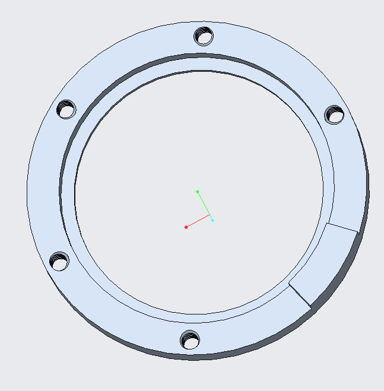
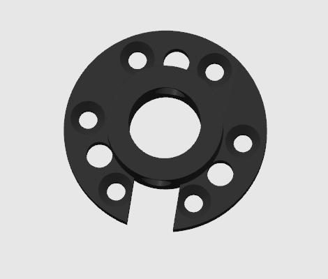

# 🤖 Descripción del hardware de código abierto reBot DevArm

  

  <strong>
    <a href="./readme_zh.md">简体中文</a> &nbsp;|&nbsp;
    <a href="./readme.md">English</a> &nbsp;|&nbsp;
    <a href="./readme_jp.md">日本語</a>&nbsp;|&nbsp;
    <a href="./readme_fr.md">français</a>&nbsp;|&nbsp;
    <a href="./readme_es.md">Español</a>
  </strong>

La BOM actual es la lista de componentes del brazo robótico **reBot Arm B601 DM**, que utiliza los **motores de la serie Damiao 43**. Otra versión, el brazo robótico **reBot Arm B601 RS**, utiliza **motores RobStride**. [Consulte la lista aquí](../reBot_B601_RS/README_zh.md)

# 📦 Estructura de archivos

* `3D_Printed_Parts/`: archivos STEP de todas las piezas impresas en 3D.
* `Metal_Parts/`: archivos STEP de todas las piezas metálicas mecanizadas.
* `Purchased_Parts/`: archivos STEP de todas las piezas compradas.
* `reBot_B601_DM_v1.0_20260425.step`: archivo de ensamblaje completo del brazo robótico.

# 📊 Lista de materiales (BOM)

> [!WARNING]
> Por la presente se declara: la BOM publicada **no** representa la versión final enviada por Seeed. Esta versión de código abierto `v1.1` está destinada a ayudar a los desarrolladores a reproducir el diseño por sí mismos con el menor costo posible y, por lo tanto, reduce algunos gastos innecesarios relacionados con detalles. La versión final enviada por Seeed incluirá detalles que aumentan el costo, como marcas antierrores grabadas con láser en las piezas metálicas, reemplazo de algunas piezas impresas en 3D por piezas metálicas para mayor durabilidad, ajustes de holgura y precisión de mecanizado basados en las tolerancias de las fábricas de procesamiento de metal (un equilibrio entre precisión y costo), personalización especial del arnés de cables (por ejemplo, añadiendo protección con malla trenzada) y otras optimizaciones de detalle. Sin embargo, la configuración estructural sigue siendo la misma.

---

## 🖨️ Piezas impresas en 3D

| Descripción de la pieza | Image | File Name | Material | Quantity | Notes |
|----------|------|--------|------|----------|------|
| Plataforma base del brazo robótico |  | `01_BASE_Plate.step` | Bambu ABS Black | 1 | boquilla 0.4, altura de capa 0.2, relleno 30% |
| Base del brazo robótico |  | `01_BASE_Link.step` | Bambu ABS Black | 1 | boquilla 0.4, altura de capa 0.2, relleno 30% |
| Relleno izquierdo del brazo superior |  | `01_Upper_Arm_Fuller_L.step` | Bambu PLA Black and Green | 1 | boquilla 0.4, altura de capa 0.2, relleno 15% |
| Relleno derecho del brazo superior |  | `01_Upper_Arm_Fuller_R.step` | Bambu PLA Black and Green | 1 | boquilla 0.4, altura de capa 0.2, relleno 15% |
| Relleno central del brazo superior |  | `01_Upper_Arm_Fuller_M.step` | Bambu ABS Black | 1 | boquilla 0.4, altura de capa 0.2, relleno 30% |
| Tope horizontal del brazo superior |  | `01_Upper_Arm_Limit.step` | Bambu ABS Black | 1 | boquilla 0.4, altura de capa 0.2, relleno 30% |
| Asa del brazo robótico |  | `01_Arm_Handle.step` | Bambu ABS Black | 1 | boquilla 0.4, altura de capa 0.2, relleno 30% |
| Relleno izquierdo del antebrazo |  | `01_Lower_Arm_Filler_L.step` | Bambu PLA Black and Green | 1 | boquilla 0.4, altura de capa 0.2, relleno 15% |
| Relleno derecho del antebrazo |  | `01_Lower_Arm_Filler_R.step` | Bambu PLA Black and Green | 1 | boquilla 0.4, altura de capa 0.2, relleno 15% |
| Relleno central del antebrazo |  | `01_Lower_Arm_Filler_M.step` | Bambu ABS Black | 1 | boquilla 0.4, altura de capa 0.2, relleno 30% |
| Cubierta decorativa del brazo superior |  | `01_Upper_Arm_Cover.step` | Bambu PLA Green | 1 | boquilla 0.4, altura de capa 0.2, relleno 15% |
| Cubierta decorativa del antebrazo |  | `01_Lower_Arm_Cover.step` | Bambu PLA Green | 1 | boquilla 0.4, altura de capa 0.2, relleno 15% |
| Cubierta protectora del motor n.º 5 |  | `01_Motor_Cover.step` | Bambu ABS Black | 1 | boquilla 0.4, altura de capa 0.2, relleno 30% |
| Tope horizontal de la pinza |  | `01_Lower_Arm_Limit.step` | Bambu PLA Green | 1 | boquilla 0.4, altura de capa 0.2, relleno 15% |
| Soporte de relleno del deslizador de la pinza |  | `01-Rail-Bracket.step` | Bambu PLA Green | 1 | boquilla 0.4, altura de capa 0.2, relleno 15% |
| Pinza |  | `01_Finger.step` | Bambu ABS Black | 2 | boquilla 0.4, altura de capa 0.2, relleno 45% |
|  | `Reference price` | Promedio **50 $** |  |  | El precio puede variar ligeramente según el precio del material de impresión y el tiempo de impresión de la fábrica |

### 🧩 Recomendaciones de impresión

- Altura de capa: 0.2 mm
- Boquilla: 0.4 mm
- Soportes: añadir según sea necesario
- Materiales: las piezas que necesitan soportar calor y cierta fuerza utilizan material ABS con un relleno del 30% al 80%, y también pueden cambiarse a materiales de nailon / reforzados con fibra de carbono; las piezas de apariencia/decorativas utilizan PLA con un relleno del 15%.
- Materiales recomendados para piezas portantes:

---

## 🔩 Piezas metálicas mecanizadas

> [!WARNING]
> Algunas piezas que pueden sustituirse por impresión 3D se indican en las notas a continuación, lo que puede reducir aún más considerablemente los costos.

| Descripción de la pieza | Image | File Name | Material | Quantity | Manufacturing Process | Notes |
|----------|------|--------|----------|------|------|------|
| Posición de montaje del rodamiento del motor 1 |  | `02_Base_Motor_Shim.step` | Aleación de aluminio 5052 | 1 | CNC | Puede sustituirse por ABS impreso en 3D con mayor relleno para reducir costos |
| Eje giratorio del motor 1 |  | `02_Arm_Yaw_Limit.step` | Aleación de aluminio 5052 | 1 | CNC | Añade límite de movimiento del ángulo de guiñada |
| Espaciador frontal para los motores 2-5 |  | `02_Motor_Front_Spacer.step` | Aleación de aluminio 5052 | 4 | CNC | Puede sustituirse por ABS impreso en 3D, relleno 30%, para reducir costos |
| Espaciador trasero para los motores 2-4 |  | `02_Motor_Back_Spacer.step` | Aleación de aluminio 5052 | 3 | CNC |  |
| Brida trasera para los motores 2-4 |  | `02_FLANGE.step` | Aleación de aluminio 5052 | 3 | CNC |  |
| Base del motor de muñeca 5 |  | `02_Wrist_Bracket.step` | Aleación de aluminio 5052 | 1 | CNC |  |
| Conector de pinza A |  | `02_Gripper_Connector_A.step` | Aleación de aluminio 5052 | 1 | CNC |  |
| Conector de pinza B |  | `02_Gripper_Connector_B.step` | Aleación de aluminio 5052 | 1 | CNC |  |
| Soporte metálico del deslizador de la pinza |  | `02_Slider_Bracket.step` | Aleación de aluminio 5052 | 1 | CNC | Puede sustituirse por ABS impreso en 3D con mayor relleno para reducir costos, pero no se recomienda para uso a largo plazo |
| Deslizador y conector de pinza |  | `02_Slider_Extension.step` | Aleación de aluminio 5052 | 2 | CNC |  |
| Conector izquierdo de la articulación entre brazo superior e inferior |  | `02_Lower_Upper_Link_L.step` | Aleación de aluminio 5052 | 1 | CNC |  |
| Conector derecho de la articulación entre brazo superior e inferior |  | `02_Lower_Upper_Link_R.step` | Aleación de aluminio 5052 | 1 | CNC |  |
| Conector izquierdo de la articulación entre antebrazo y muñeca |  | `02_Lower_Wrist_Link_L.step` | Aleación de aluminio 5052 | 1 | CNC |  |
| Conector derecho de la articulación entre antebrazo y muñeca |  | `02_Lower_Wrist_Link_R.step` | Aleación de aluminio 5052 | 1 | CNC |  |
| Conector de engranaje |  | `02_Gear_Connector.step` | Aleación de aluminio 5052 | 1 | CNC | Para baja carga, puede utilizarse ABS impreso en 3D con relleno del 80% para reducir costos; para alta carga, se recomienda mecanizado CNC en metal |
| Cremallera |  | `02_Rack.step` | Aleación de aluminio 5052 | 2 | CNC |  |
| Link 1 |  | `03-Link1.step` | Aleación de aluminio 5052 | 1 | CNC + chapa metálica |  |
| Link 2 |  | `03-Link2.step` | Aleación de aluminio 5052 | 2 | CNC + chapa metálica |  |
| Link 3 izquierdo |  | `03-Link3_L.step` | Aleación de aluminio 5052 | 1 | CNC + chapa metálica |  |
| Link 3 derecho |  | `03-Link3_R.step` | Aleación de aluminio 5052 | 1 | CNC + chapa metálica |  |
| Link 5 |  | `03-Link5.step` | Aleación de aluminio 5052 | 1 | CNC + chapa metálica |  |
| Precio de referencia de mercado múltiple |  | Promedio **250 $** |  |  |  | El precio puede variar ligeramente debido a las fluctuaciones del costo del aluminio 5052, los requisitos de precisión de mecanizado, el plazo de entrega de la fábrica, etc. |

### 🧩 Instrucciones de mecanizado

- Tolerancia dimensional crítica: ±0.02 mm, GB/T1840-M;
- Tratamiento superficial: anodizado / arenado
- Se recomienda usar H7 / ajuste por interferencia en las piezas de acoplamiento

---

## 🛒 Piezas compradas (piezas estándar)

> [!WARNING]
> Dado que todos tendrán que armar y atornillar por su cuenta, se han seleccionado tornillos hexagonales internos estándar. Después de un funcionamiento prolongado, los tornillos pueden aflojarse y afectar la precisión del brazo robótico.
Por ello, es necesario comprar adicionalmente pegamento termofusible para realizar un tratamiento antiflojamiento en los tornillos de cada articulación. Si disponen de taladro eléctrico u otras herramientas, pueden adquirir tornillos antiflojamiento. Sin embargo, es muy importante usar la potencia mínima con el destornillador eléctrico para evitar dañar la rosca y causar pérdidas irreversibles.

| Name | Specification / Model | Quantity | Reference Price | Notes |
|------|----------|------|----------|------|
| Motor sin escobillas | DM4310(V4) | 4 | 120 $/unit | [SeeedStudio](https://www.seeedstudio.com/DIP-Servo-Motor-24V-120RPM-Brushless-98-9mm-4P-L56-W56-H46mm-p-6660.html) |
| Motor sin escobillas | DM4340P(V4) | 3 | 175 $/unit |  [SeeedStudio](https://www.seeedstudio.com/DM4340P-Actuator-p-6663.html)  |
| Placa controladora CAN-USB |  | 1 | 15 $/unit |   [SeeedStudio](https://www.seeedstudio.com/DM-CAN-USB-Driver-Borad-p-6706.html)   |
| Rodamiento | 6707ZZ | 1 | 13 $/unit | [Amazong](https://www.amazon.com/uxcell-35x44x5mm-Shielded-Precision-Lubricated/dp/B0D6WBMW3F/ref=sr_1_1?crid=3J03FBU7MI31J&dib=eyJ2IjoiMSJ9.sfX192-ZSyqh-VJEgq6jR02DrJcdVTxBbKWn5TLypwoK7NyklXkZSQT-3V42_zTm98_Y8dLCtnTzJ9JVnPuBG7bfvUYv0ctrasWhZgU5DFtl2y0CtKLOUOoukmlHqCfonkjZLapmfzSVAaV-3CJYhqizbjedl6zGoDUNo2ryKd4RbtRhJXndBmf96HwTPrPH8g8KB2NPyhnPaP36r6C0Ehdb0xrqjNzKt7YcM7xkZ_8.QvCzMQ0EPe3-5SBYNcuoO5L-Yx0CSr9Vmjc-Ma7FzbY&dib_tag=se&keywords=6707ZZ&qid=1774771772&sprefix=6707zz%2Caps%2C376&sr=8-1) |
| Rodamiento | 6803ZZ | 3 | 13 $/unit | [Amazong](https://www.amazon.com/uxcell-17x26x5mm-Shielded-Precision-Lubricated/dp/B0D54JSWBZ/ref=sr_1_1?crid=17L94NDI1JCC0&dib=eyJ2IjoiMSJ9.xH_s9Ui7VlS40EZvr-HektqY3VOJsM-VjyE6JaJEScIWuFZ2UYSM7G8j1fC0HSmbb7YlA0YfUxxCkUzBptwrEEdEHsP94TGplNpPAWwhnH8b76HapXR_uHbr1vu3xe0AYSYP30Quk9LMQrGjUh84bXL82z2mORuiri0VHqo5DmSguK0cHubmVaXtbR_eJ43Z7L2nNqWfgltqzmHsYm7DQvrnIBg9UMlD1o9559nCSKA.E_N7CDPQhShckT-1vHDhYvNgiqRKusa12d43hqATQ5A&dib_tag=se&keywords=6803ZZ&qid=1774771801&sprefix=6803zz%2Caps%2C397&sr=8-1) |
| Rodamiento | AXK5578 | 1 | 12 $/unit | [Amazong](https://www.amazon.com/PZRT-AXK5578-Thrust-Bearings-Washers/dp/B0B3M3RZGW/ref=sr_1_1?dib=eyJ2IjoiMSJ9.TatYkzOvpYAJ5K23C7Qr9JKJsPhpJE8p1L3k5_1YqQ7ozSLNgOBEeG9pTYz-WXOWiHkbJq_zZR4FxNHAJZ4euyfOGXkOKycOyN0pUD0_WkJia0PekbRy0sYvyQbE7KZByR-40WiPSPuUcysFewSngPoDGQZzESFOUz__V9ViGCIQAPfdUe2OxVpvtbKZYCQsrSDm8b8okR25bavCvpDbBfPh0He2PEBEpl55L8RtYKmlv62XJyfYT1o29A7wO5n8-g3hpJOrKmmWCybdEEWSmquAT1cjvsPTJDaT_TICsso.6xR5pEGJgTR-u_NOyXxi8VTphoLytGd8zugy1-xu-fE&dib_tag=se&keywords=AXK5578&qid=1774771826&sr=8-1&th=1) |
| Riel lineal | MGN9-170mm | 1 | 23 $/unit | [Amazong](https://www.amazon.com/uxcell-Sliding-Carriage-Bearing-Printers/dp/B0D54L45WM/ref=sr_1_1?dib=eyJ2IjoiMSJ9.qNphfY5r4UgLDHslIliMBhC45qBKTl37lJseObJSBp79RJ4VJnAH-lYAMo-rwPiu_uqWmkN7ms4kfAokYvod1seWb5-z2_kVgVuzrCXdiRycNXjrdv3qi5Awuno0_vEqjT4WJ569tAmqm_Rujrdxss7VfpLizFxq6-R8DucuvqZ0M0Y4go9PzRFEFPu4csskz7-UkM1CUidHoKmrT-I7R1Ta0dijj2SYlR_zW0si75k.nRJTebbqw-bFyzkdU8MztHnGdt9qwnHr_gIqa-MDxEQ&dib_tag=se&keywords=MGN9&qid=1774771864&sr=8-1) |
| Bloque deslizante | MGN9 | 2 | 10 $/unit | [Amazong](https://www.amazon.com/uxcell-Bearing-Sliding-Carriage-Anti-Fall/dp/B0D9QBQDKB/ref=sr_1_8?dib=eyJ2IjoiMSJ9.qNphfY5r4UgLDHslIliMBhC45qBKTl37lJseObJSBp79RJ4VJnAH-lYAMo-rwPiu_uqWmkN7ms4kfAokYvod1seWb5-z2_kVgVuzrCXdiRycNXjrdv3qi5Awuno0_vEqjT4WJ569tAmqm_Rujrdxss7VfpLizFxq6-R8DucuvqZ0M0Y4go9PzRFEFPu4csskz7-UkM1CUidHoKmrT-I7R1Ta0dijj2SYlR_zW0si75k.nRJTebbqw-bFyzkdU8MztHnGdt9qwnHr_gIqa-MDxEQ&dib_tag=se&keywords=MGN9&qid=1774771864&sr=8-8) |
| Engranaje | Módulo 1, tipo cubo, 16 dientes, agujero de 6 mm | 1 | 44$/unit | [Amazong](https://www.amazon.com/Module-15-Teeth-Finished-Perforation/dp/B0GDSR1LKM/ref=sr_1_1?crid=2EN1YHE8TEC58&dib=eyJ2IjoiMSJ9.54N73iSlush8K1a_teRazjBGZaQnbFM4MLysEbIq430CEYcVs0slm8KhpC_JlmjyVMocPA3vLANjERYZWweRag36NhX2GGldVTpd31kAWW4.ws8l0qBABmSVrUGX4g2o3sBbUgOnNhl3Nx_Nt-d1HT8&dib_tag=se&keywords=1%2Bmodule16%2Bteeth&qid=1774772022&sprefix=1%2BModule16%2Bteeth%2Caps%2C403&sr=8-1&th=1)  |
| Almohadilla de silicona | 30*9*2mm | 1 | 10 $ | [Amazong](https://www.amazon.com/Self-Adhesive-Anti-Sliding-Anti-Scratch-Protectors-Appliances/dp/B0F9KVYXFZ/ref=sr_1_3?crid=LVY2LLBFQT6J&dib=eyJ2IjoiMSJ9.4qjOEtjEph1QxS_kJF2vIYqvD_8Lzt4GZ2rrywWbrAhniBvp_8YrEsVNcCPQofO4jVqBxFE8Yplyg2XXgAXlUZwzqE-Gp8MYcaPmphL8Mc1n-ARSCNaTq5gc7ZIWsS6u-kR0G2BzIlBo6NF88KvASjKYJfTHpPXHfNCPVw13P-PseVbUZwlVAO9zMHa3a84gHRd-I-mGB8SCmek9mXjN-c-bFxKvJXlz4C5YBBdt9cH3QkSmLgiLZ_iD4K1mh-MwI5WuVOXr5ZOwJ0bVpmHpc_vpbKLr7CkVack3nsC-TM0.40ujhwS5ConOfA8io_c5hcdos70HOKjMFqqKLKgNwI8&dib_tag=se&keywords=silicone%2Bsticker&qid=1774772199&sprefix=silicone%2Bsticker%2Caps%2C380&sr=8-3&th=1) |
| Separador de cobre | M4x50mm | 4 | 8 $ | [Amazong](https://www.amazon.com/Female-Standoff-Quadcopter-Computer-Circuit/dp/B09V2CYDMG/ref=pd_bxgy_thbs_d_sccl_2/143-1519846-1961845?pd_rd_w=PozMT&content-id=amzn1.sym.9bef5913-5870-4504-8883-3ba89d7f8e39&pf_rd_p=9bef5913-5870-4504-8883-3ba89d7f8e39&pf_rd_r=0EFDXBJRP1YKJ1QZP2ZW&pd_rd_wg=ARxCM&pd_rd_r=e182821b-861c-468b-889a-961171840b9e&pd_rd_i=B09NDJJJT8&th=1) |
| Tornillo | Tornillo M3*22mm | Several |  | [Amazong](https://www.amazon.com/METERXITY-50-Pack-Stainless-Threaded-Fasteners/dp/B0FLYG7WZ7/ref=sr_1_3?crid=19X2IQA3ZLJ0S&dib=eyJ2IjoiMSJ9.d4sRDJZ5dCEYkeD4R4dK1WKv6ingc4WOzs0gSnaRNSZsH8aZ-O4uPZZMCurzxm51bzHA3eFgbeHeAp8Syk9BeSPW7epijY_Xce0qqzjA6ewZVIyEozLiMf4t_dMlWFwksFEH0PXNLm6kX4mnwevDmzYKQ6Hz9CNWW_GGQ9_N_LLHJ04qCgwiB4r-RCYG_nUTGj_MeKYAgcx_Kyq0LrKhWWtoYKuYEk4YCbup2_A__OmImZsH8gHwf60F290kPib8LM2ZS1eYZOs8pKCYcC2aTv1rgCW--NrSaTNzVyrzzA4.kHLelL_2m16mzL_HV_7le-Z4zVN7ugxUhS7CLEf1Kc0&dib_tag=se&keywords=M3*22mm%2Bscrew&qid=1774772349&s=industrial&sprefix=m3%2B22mm%2Bscrew%2Cindustrial%2C360&sr=1-3&th=1)  |
| Tornillo | Tornillo M4*16mm | Several |  | [Amazong](amazon.com/BNUOK-120pcs-Stainless-Threads-Spanner/dp/B0DYNFFB7Q/ref=sr_1_9?crid=W94HLTGLCH57&dib=eyJ2IjoiMSJ9.jg07IMpJdHhW8vR9Ewx53UNnQs_QkpENya6ZqIQWoB6rsXjPLmfWMgAytRy7neNPJJHQzVyP9H7FO5sm9KN9I34nKUQsLRZAG48Rs2rSHwlh2mpA2IPlezHLRlvLN49IIbiHgk5Y63iPwAaxKT27sG3dhyXpf-EABXWIlgUu0FBQ3IIA5kiQDccrsIPN06nR6XBFnNeTu1ogpvhiaZsK7R-VRXcFAsrQvOc4tnzXLlTSM68gR8hBmGYZtQUoOJrRo93U1xfGf7kODnnOqUBWI3VhQIMgnl8Rtt4pl3H7IK0._jHfn0N3UQ0z_FJlv4C8jBXiadkqdO-IHWJzQ3xlm0w&dib_tag=se&keywords=M4*16mm+screw&qid=1774772422&s=industrial&sprefix=m4+16mm+screw%2Cindustrial%2C364&sr=1-9)  |
| Tornillo | Tornillo prisionero M3*8mm | 5 | 5$ | [Amazong](https://www.amazon.com/Headless-Internal-Stainless-Concave-External/dp/B0D8TGXG9D/ref=sr_1_2?crid=1ZC6Q386LVVYI&dib=eyJ2IjoiMSJ9.3gxD3z1pacUWn2K2NhP0E3OT3j4eoX5mgRDnPfjcCROA7jaVGInIa78o3sE6xleew-Wst2XDHDbExBsltVm2HBiZc6DrUZXO1flMeCHVwKlfksjVw4v-AKoqjonhSsu_t8ocxlmxeRcF95IvvYtaZUZEGpUlhz0Rcx4C5Sk_ZpdHwDUQKgKz_mktcerkTMZ8zMoXGAp8wlHXNXytlXmaoMd16wx--KynCDbtUzeyk_EZErs_9mFVhlP-00-_J-GH0GFshobV-_k9clpEvm4jwS0KDBKuFT0wVWu9QAL2MKE.MKnBsq9xbFeTfdL0mlkBNCjnaBj09nS25kBcpRqfW1k&dib_tag=se&keywords=M3*8mm+set+screw&qid=1774772443&s=industrial&sprefix=m3+8mm+set+screw%2Cindustrial%2C353&sr=1-2)  |
| Tornillo | Tornillo avellanado M3*22mm | Several |  |  [Amazong](https://www.amazon.com/Countersunk-DIN7991-Stainless-Threaded-Fasteners/dp/B0CG1PV6SH/ref=sr_1_1?crid=3LW6LGEBQ9V1R&dib=eyJ2IjoiMSJ9.w_eVqGVJleAAwAsk9U038mfQNN_9V1CiCXnQYShTV_vUp6a9tEFQZ6RX1A1NKWY41iluavltyZG2bhZkdfW1DTIao0AMmdXD1iPDMumzmWqlepecA_oe0vRvmjJGJUUGqH6yBLEXoHgljlHmisrfetu6TOiLw6JBF7U4URcGOWiU5WZej0N9hSmyl9YbyDliozDIK1OSrhnE4K5Qa3mdDig34gt7Rz_fz3bOA-azhWt0TpwFGBiGfGKIwHt9bFJYBf1Jeuiqr2JTp93e6lyJ1Dyzzz1ODiVIFXJ4Z2H1T18.7HlJR0GjprXvY6P4G75sFNvjGApEFl73kwBfhV923jM&dib_tag=se&keywords=M3*22mm%2Bcountersunk%2Bscrew&qid=1774772466&s=industrial&sprefix=m3%2B22mm%2Bcountersunk%2Bscrew%2Cindustrial%2C372&sr=1-1&th=1) |
| Tornillo | Tornillo avellanado M3*8mm | Several |  | [Amazong](https://www.amazon.com/Countersunk-DIN7991-Stainless-Threaded-Fasteners/dp/B0CG1PV6SH/ref=sr_1_1?crid=3LW6LGEBQ9V1R&dib=eyJ2IjoiMSJ9.w_eVqGVJleAAwAsk9U038mfQNN_9V1CiCXnQYShTV_vUp6a9tEFQZ6RX1A1NKWY41iluavltyZG2bhZkdfW1DTIao0AMmdXD1iPDMumzmWqlepecA_oe0vRvmjJGJUUGqH6yBLEXoHgljlHmisrfetu6TOiLw6JBF7U4URcGOWiU5WZej0N9hSmyl9YbyDliozDIK1OSrhnE4K5Qa3mdDig34gt7Rz_fz3bOA-azhWt0TpwFGBiGfGKIwHt9bFJYBf1Jeuiqr2JTp93e6lyJ1Dyzzz1ODiVIFXJ4Z2H1T18.7HlJR0GjprXvY6P4G75sFNvjGApEFl73kwBfhV923jM&dib_tag=se&keywords=M3*22mm%2Bcountersunk%2Bscrew&qid=1774772466&s=industrial&sprefix=m3%2B22mm%2Bcountersunk%2Bscrew%2Cindustrial%2C372&sr=1-1&th=1)  |
| Tornillo | Tornillo avellanado M3*16mm | Several |  |[Amazong](https://www.amazon.com/Countersunk-DIN7991-Stainless-Threaded-Fasteners/dp/B0CG1PV6SH/ref=sr_1_1?crid=3LW6LGEBQ9V1R&dib=eyJ2IjoiMSJ9.w_eVqGVJleAAwAsk9U038mfQNN_9V1CiCXnQYShTV_vUp6a9tEFQZ6RX1A1NKWY41iluavltyZG2bhZkdfW1DTIao0AMmdXD1iPDMumzmWqlepecA_oe0vRvmjJGJUUGqH6yBLEXoHgljlHmisrfetu6TOiLw6JBF7U4URcGOWiU5WZej0N9hSmyl9YbyDliozDIK1OSrhnE4K5Qa3mdDig34gt7Rz_fz3bOA-azhWt0TpwFGBiGfGKIwHt9bFJYBf1Jeuiqr2JTp93e6lyJ1Dyzzz1ODiVIFXJ4Z2H1T18.7HlJR0GjprXvY6P4G75sFNvjGApEFl73kwBfhV923jM&dib_tag=se&keywords=M3*22mm%2Bcountersunk%2Bscrew&qid=1774772466&s=industrial&sprefix=m3%2B22mm%2Bcountersunk%2Bscrew%2Cindustrial%2C372&sr=1-1&th=1)   |
| Tornillo | Tornillo autorroscante M3*12mm | Several |  | [Amazong](https://www.amazon.com/Countersunk-DIN7991-Stainless-Threaded-Fasteners/dp/B0CG1PV6SH/ref=sr_1_1?crid=3LW6LGEBQ9V1R&dib=eyJ2IjoiMSJ9.w_eVqGVJleAAwAsk9U038mfQNN_9V1CiCXnQYShTV_vUp6a9tEFQZ6RX1A1NKWY41iluavltyZG2bhZkdfW1DTIao0AMmdXD1iPDMumzmWqlepecA_oe0vRvmjJGJUUGqH6yBLEXoHgljlHmisrfetu6TOiLw6JBF7U4URcGOWiU5WZej0N9hSmyl9YbyDliozDIK1OSrhnE4K5Qa3mdDig34gt7Rz_fz3bOA-azhWt0TpwFGBiGfGKIwHt9bFJYBf1Jeuiqr2JTp93e6lyJ1Dyzzz1ODiVIFXJ4Z2H1T18.7HlJR0GjprXvY6P4G75sFNvjGApEFl73kwBfhV923jM&dib_tag=se&keywords=M3*22mm%2Bcountersunk%2Bscrew&qid=1774772466&s=industrial&sprefix=m3%2B22mm%2Bcountersunk%2Bscrew%2Cindustrial%2C372&sr=1-1&th=1)  |
| Pasador cilíndrico | M4*8mm | Several |  | [Amazong](https://www.amazon.com/Countersunk-DIN7991-Stainless-Threaded-Fasteners/dp/B0CG1PV6SH/ref=sr_1_1?crid=3LW6LGEBQ9V1R&dib=eyJ2IjoiMSJ9.w_eVqGVJleAAwAsk9U038mfQNN_9V1CiCXnQYShTV_vUp6a9tEFQZ6RX1A1NKWY41iluavltyZG2bhZkdfW1DTIao0AMmdXD1iPDMumzmWqlepecA_oe0vRvmjJGJUUGqH6yBLEXoHgljlHmisrfetu6TOiLw6JBF7U4URcGOWiU5WZej0N9hSmyl9YbyDliozDIK1OSrhnE4K5Qa3mdDig34gt7Rz_fz3bOA-azhWt0TpwFGBiGfGKIwHt9bFJYBf1Jeuiqr2JTp93e6lyJ1Dyzzz1ODiVIFXJ4Z2H1T18.7HlJR0GjprXvY6P4G75sFNvjGApEFl73kwBfhV923jM&dib_tag=se&keywords=M3*22mm%2Bcountersunk%2Bscrew&qid=1774772466&s=industrial&sprefix=m3%2B22mm%2Bcountersunk%2Bscrew%2Cindustrial%2C372&sr=1-1&th=1)  |
| Pasador cilíndrico | M4*12mm | Several |  | [Amazong](https://www.amazon.com/Countersunk-DIN7991-Stainless-Threaded-Fasteners/dp/B0CG1PV6SH/ref=sr_1_1?crid=3LW6LGEBQ9V1R&dib=eyJ2IjoiMSJ9.w_eVqGVJleAAwAsk9U038mfQNN_9V1CiCXnQYShTV_vUp6a9tEFQZ6RX1A1NKWY41iluavltyZG2bhZkdfW1DTIao0AMmdXD1iPDMumzmWqlepecA_oe0vRvmjJGJUUGqH6yBLEXoHgljlHmisrfetu6TOiLw6JBF7U4URcGOWiU5WZej0N9hSmyl9YbyDliozDIK1OSrhnE4K5Qa3mdDig34gt7Rz_fz3bOA-azhWt0TpwFGBiGfGKIwHt9bFJYBf1Jeuiqr2JTp93e6lyJ1Dyzzz1ODiVIFXJ4Z2H1T18.7HlJR0GjprXvY6P4G75sFNvjGApEFl73kwBfhV923jM&dib_tag=se&keywords=M3*22mm%2Bcountersunk%2Bscrew&qid=1774772466&s=industrial&sprefix=m3%2B22mm%2Bcountersunk%2Bscrew%2Cindustrial%2C372&sr=1-1&th=1)  |
| Juego de destornilladores | Juego de llaves hexagonales | 1 | 16$  | [Amazong](amazon.com/Amazon-Basics-Ratcheting-Electronics-Screwdriver/dp/B07V4TFWFZ/ref=sr_1_2?crid=ADAY70RZDSLN&dib=eyJ2IjoiMSJ9.jcLL4o6IXTnPlPfTTzbCZCBuZx2sLkvdUQCwlL58aq__GOyLxVPnwLI0mvGptba_HeVz6ctLQ_ziQw56BMDH9IOaw-4PVJGMktQM74mWficwggm3ckDGyAH-agN_zkB3K0_W-wrS56jfcMYFbZSWhWxr-iSOC4sdXwMGlt4rYGtenyn9yAFYBIHqjU2El5_OAKuspsrF0yQvfyfQPQHs46SClWN8zlSemGVZRuVSU26f0f9yApF6BfWHANKNNhT0Mfb6bQ8oM2XUMvwaazrrKoHeTARuoflVaVZvMU776bs.r8gy_gMINEy0qy4JyK--z-IbPZEv-SWeMGohOOE7M60&dib_tag=se&keywords=Screwdriver+set&qid=1774772499&s=industrial&sprefix=screwdriver+set+%2Cindustrial%2C374&sr=1-2)  |
|    | XT30 2+2 350mm | 2 | 4 $/cable | Ambos extremos en ángulo |
|    | XT30 2+2 350mm | 1 | 4 $/cable | Un extremo en ángulo y un extremo recto |
|    | XT30 2+2 200mm | 3 | 4 $/cable | Ambos extremos en ángulo |
| Requerido personalizado | XT30 2+2 200mm | 1 | 3 $/cable | Ambos extremos rectos |

### Concernant la fixation
Vous pouvez modifier librement la base à l'aide des pièces imprimées en 3D fournies. Vous pouvez également utiliser des serre-joints en fonction de l'épaisseur de votre plateau de table.

| Désignation | Spécifications / Référence | Quantité | Prix de référence | Remarques |
|------|----------|------|----------|------|
| Serre-joint à bois | Serre-joint G de 6 pouces | 2 | 20 $/unité | [Amazon](https://www.amazon.com/gp/aw/d/B092J1YW2M/?_encoding=UTF8&pd_rd_plhdr=t&aaxitk=3557c048ce58e7dbb50b40c3af69f1d6&hsa_cr_id=0&qid=1774772748&sr=1-1-9e67e56a-6f64-441f-a281-df67fc737124&ref_=sbx_s_sparkle_sbtcd_asin_0_img&pd_rd_w=bNqtC&content-id=amzn1.sym.2fb72bc8-96ef-420d-b08f-c04b69f36507%3Aamzn1.sym.2fb72bc8-96ef-420d-b08f-c04b69f36507&pf_rd_p=2fb72bc8-96ef-420d-b08f-c04b69f36507&pf_rd_r=KDCPNZRHFWEWBWVHWSTR&pd_rd_wg=sBvfF&pd_rd_r=52b946ee-46e2-4e74-86ee-99e291552e44) |

### Concernant l'alimentation électrique
Le bras robotique est livré sans alimentation d'origine. Vous pouvez brancher votre propre batterie ou acheter une alimentation fiable MeanWell de 24V 14,6A fabriquée à Taïwan. De plus, vous devrez vous procurer une fiche trois broches conforme aux normes locales ainsi qu'un faisceau de câbles équipé d'un connecteur femelle XT30.

| Désignation | Spécifications / Référence | Quantité | Prix de référence | Remarques |
|------|----------|------|----------|------|
| Alimentation électrique | 24V 14,6A | 1 | 30 $ | [Amazon](https://www.amazon.com/MEAN-WELL-LRS-350-24-350-4W-Switchable/dp/B013ETVO12/ref=sr_1_1?crid=2559HZMZF6ZUS&dib=eyJ2IjoiMSJ9.vpZwmjb4m5KMNcsg2Kb7wtfqG-A8US11Eaq0B9JOtKBwPyL6ZyUXh5oUrc5lyVLibya9NQ3n4OUjZ1INKKXLtwJWsRJbA_cPohVKu19q3esXrAY8YFpA4teehMNx3zdrt_WhXZyo1zxQUEHgh558m0vuZ0G1KjW3Rk9LOUVn0olRD-nnyvOwhNycxZqoO9KHkTt4q3kkDNEtn_iAH3x1C6wSv97gxI3nFKhXETsCou11G6_97-PJwk6cEkm2aOT2Yg-xm-uYfNMg85_QRFEDdsY-yeC_8n55d_auTSqqc38.SwYH_qOo0fEt9xkz_H6RWeZ78kxrOs9QKhGEKhmfRBs&dib_tag=se&keywords=Power+supply+24V+14.6A&qid=1774772552&s=industrial&sprefix=power+supply+24v+14.6a%2Cindustrial%2C333&sr=1-1) |
| Câble d'alimentation | 12AWG | 1 | 30 $ | [Amazon](https://www.amazon.com/Pinfox-Universal-Appliance-Replacement-Pigtail/dp/B0F5PW5SJG/ref=sr_1_6?crid=1EIU51YZCRLT9&dib=eyJ2IjoiMSJ9.SAX2wYEran7eecwu4SDFfugT8z0m8kjFOv972WAv1aoYMTB-us_RgARfoKz3G9hpFqw3p4dtTfzyPzH-pQoitReEJ_DMB-xmLUg3nA3uRNNmYF9Zl9d9iX6yCcU6lCpE_GL9-oqRlTC4A2t1--_88yskpiLLBpx50I08Ze8ql2L6fVikg6k6wx6rTvhpLEHZHqDyITCApEDPPygOu4x8BkY68RpMAM1_Fsd_1M-GMb0YlT2p2u6ywbO08KJg0c3QMfTApauxKjB5INgnxKV9EspudalX0FbQUF1DBc8Fh7s.jtylu4ii8VEhu1FJG6P7h6vw5M7rNci4iQPj8IhOfr8&dib_tag=se&keywords=Power%2BCable&qid=1774772590&s=industrial&sprefix=power%2Bcab%2Cindustrial%2C413&sr=1-6&th=1) |
| Câble d'alimentation | XT30 16AWG | 1 | 9 $ | [Amazon](https://www.amazon.com/RioRand-Connector-Pigtail-Silicone-Aircraft/dp/B0FY2ZCR83/ref=sr_1_8?crid=1I8XB5AF5YIPA&dib=eyJ2IjoiMSJ9.8Cx4Olln9I8dGnZGL6MRb6AdEsUY70emHKd_NuuvYCBdrZWbUbSmWDDnYirfmFQVEexy0_clLKn2bi2DcGzjf_OEu1RM9j71jZ0-eL2Hgr0AOzFRl06OY7dQE0eMIXesWqJhHUkUoQFTA6EIegYoIUURzHkZAbT3CZyTpQoWYHOfVECyAsKDsKLoekybImOwDe1X9Ub4vawG56Ov7nBLWXf81DpwV-bH9H0kM1jTJaacHHII9eFWdd-50tChIRSI6Ld0kUIvOqbWOWHMshFgK7lHSa76icMJwJOZaruti0c.erWlQgcCcuEDYLFVqRIp7CpmiONST0SMW8W1OT-OnMg&dib_tag=se&keywords=XT30%2B14awg&qid=1774772667&s=industrial&sprefix=xt30%2B14a%2Cindustrial%2C350&sr=1-8&th=1) |

---
