# 🤖 reBot DevArm オープンソースハードウェア仕様書

  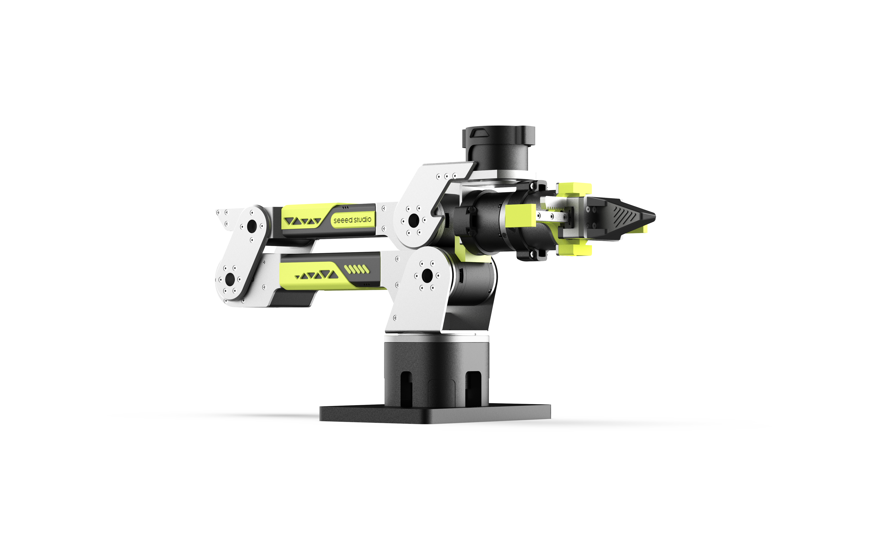

  <strong>
    <a href="./readme_zh.md">简体中文</a> &nbsp;|&nbsp;
    <a href="./readme.md">English</a> &nbsp;|&nbsp;
    <a href="./readme_jp.md">日本語</a>&nbsp;|&nbsp;
    <a href="./readme_fr.md">français</a>&nbsp;|&nbsp;
    <a href="./readme_es.md">Español</a>
  </strong>

| 日付 | バージョン | ファイル名 | 変更履歴 |
|----------|------|----------|------|
| 2026-03-31 | v1.0 | reBot_B601_DM_v1.0_20260331.step | 初回アップロード |
| 2026-04-15 | v1.1 | reBot_B601_DM_v1.1_20260415.step | エンドジョイント3つのモーターにケーブル拘束を追加し、緩みや外れを防止。ジョイント1のモデルを4310から4340Pに修正。ベース剛性を高めるため、底部にCNCパーツ 02_Base_Reinforcement_Part.step を追加。 |

このBOMは、大疆43シリーズモーターを使用する reBot Arm B601 DM ロボットアーム用です。もう一方のバージョンである reBot Arm B601 RS は RobStride モーターを使用しています。[BOMはこちら](../reBot_B601_RS/README.md)をご覧ください。

# 📦 ファイル構成
*   3D_Printed_Parts/: すべての3Dプリント部品のStepファイル。
*   Metal_Parts/: すべてのCNC加工金属部品のStepファイル。
*   Purchased_Parts/: すべての購入部品のStepファイル。
*   reBot_B601_DM_v1.1_20260415.step: ロボットアームのフルアセンブリファイル。

# 🛒[全部品を入手](https://www.seeedstudio.com/reBot-Arm-B601-DM-Bundle.html)
- 5種類のキットオプションを提供しています：
  - **アームボディモーターキット**: ロボットアーム用のモーターと配線ハーネスのみを含む。
  - **アームボディ構造キット**: 機械的構造部品のみを含む。
  - **グリッパーコンプリートキット**: グリッパー用のモーター、配線ハーネス、構造部品を含む。
  - **フルキット**: ロボットアーム本体とグリッパーの完全なセットを含む。
  - **組立済みロボットアーム**: 完全に組み立てられた完成品のロボットアーム。

# 📊 部品表 (BOM)

> [!WARNING]
> 宣言: 公開されているBOMは、Seeedからの最終出荷バージョンを**示すものではありません**。このオープンソースv1.1は、開発者が最小コストで再現できるように最適化されており、一部の必須でない詳細は簡略化されています。
> Seeedの最終生産バージョンには、誤動作防止のための金属レーザー刻印、耐久性のために一部の3Dプリント部品を金属に置き換え、工場でのばらつきに対応するためのクリアランスと加工公差の調整（精度とコストのバランス）、および追加コストでのカスタム配線（例：組み紐スリーブ保護）が含まれます。ただし、機械的構造は同一です。

---

## 🖨️ 3Dプリント部品

| 部品説明 | 画像 | ファイル名 | 材料 | 数量 | 注記 |
|----------|------|--------|------|----------|------|
| ロボットアームベースプラットフォーム | 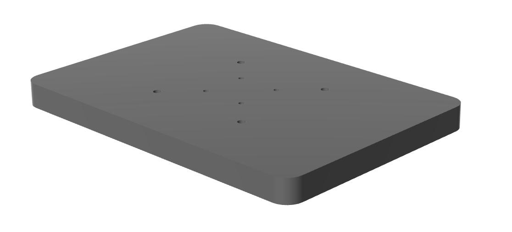 | 01_BASE_Plate.step | Bambu ABS Black | 1 | 0.4mmノズル、0.2mmレイヤー高さ、30%インフィル |
| ロボットアームベースリンク | 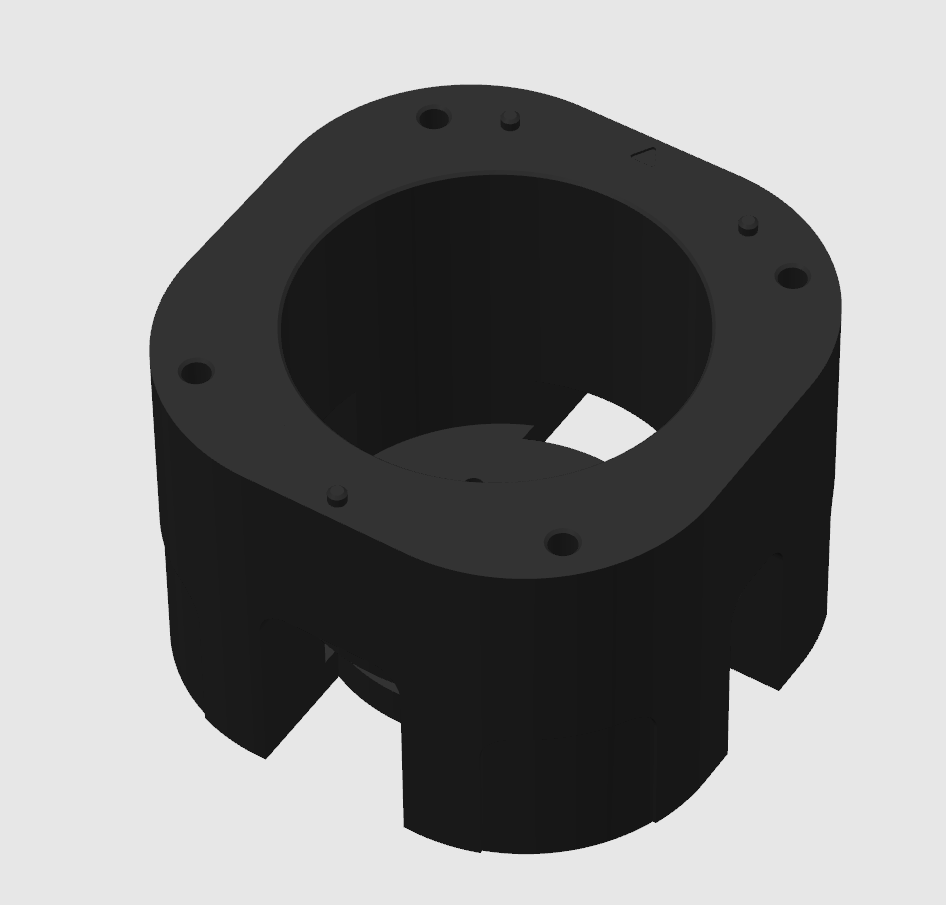 | 01_BASE_Link.step | Bambu ABS Black | 1 | 0.4mmノズル、0.2mmレイヤー高さ、30%インフィル |
| 上アーム左フィラー | 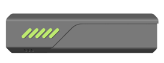 | 01_Upper_Arm_Fuller_L.step | Bambu PLA Black & Green | 1 | 0.4mmノズル、0.2mmレイヤー高さ、15%インフィル |
| 上アーム右フィラー |  | 01_Upper_Arm_Fuller_R.step | Bambu PLA Black & Green | 1 | 0.4mmノズル、0.2mmレイヤー高さ、15%インフィル |
| 上アーム中央フィラー | 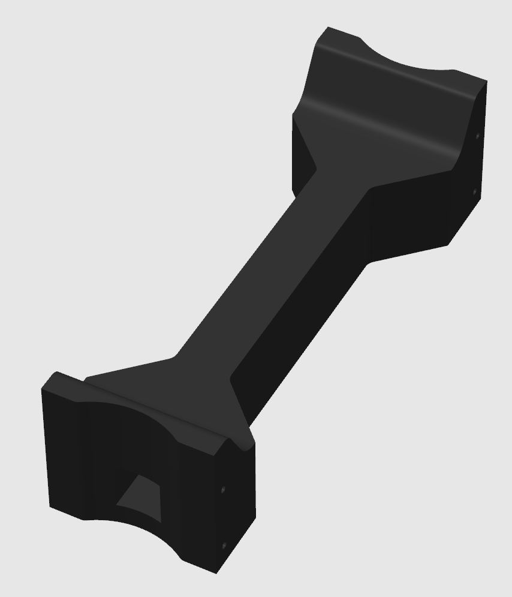 | 01_Upper_Arm_Fuller_M.step | Bambu ABS Black | 1 | 0.4mmノズル、0.2mmレイヤー高さ、30%インフィル |
| 上アーム水平リミットブロック | 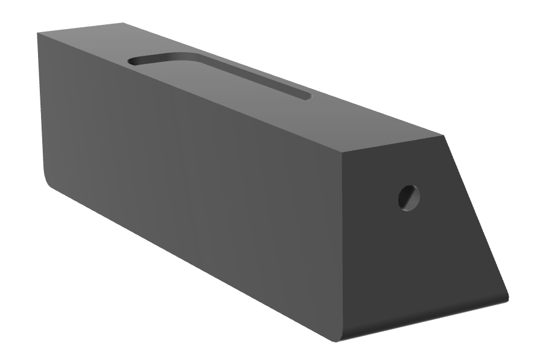 | 01_Upper_Arm_Limit.step | Bambu ABS Black | 1 | 0.4mmノズル、0.2mmレイヤー高さ、30%インフィル |
| アームハンドル | 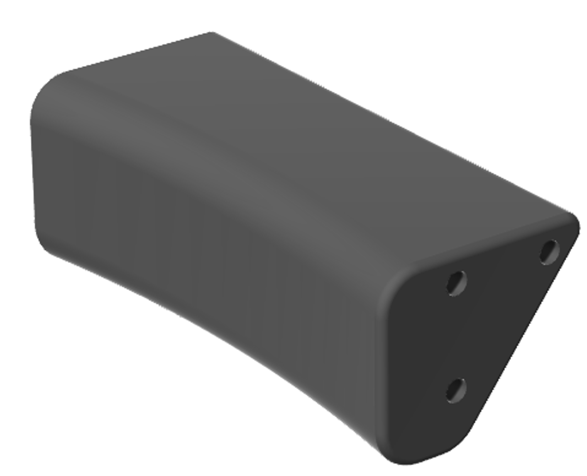 | 01_Arm_Handle.step | Bambu ABS Black | 1 | 0.4mmノズル、0.2mmレイヤー高さ、30%インフィル |
| 下アーム左フィラー | 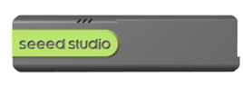 | 01_Lower_Arm_Filler_L.step | Bambu PLA Black & Green | 1 | 0.4mmノズル、0.2mmレイヤー高さ、15%インフィル |
| 下アーム右フィラー |  | 01_Lower_Arm_Filler_R.step | Bambu PLA Black & Green | 1 | 0.4mmノズル、0.2mmレイヤー高さ、15%インフィル |
| 下アーム中央フィラー | 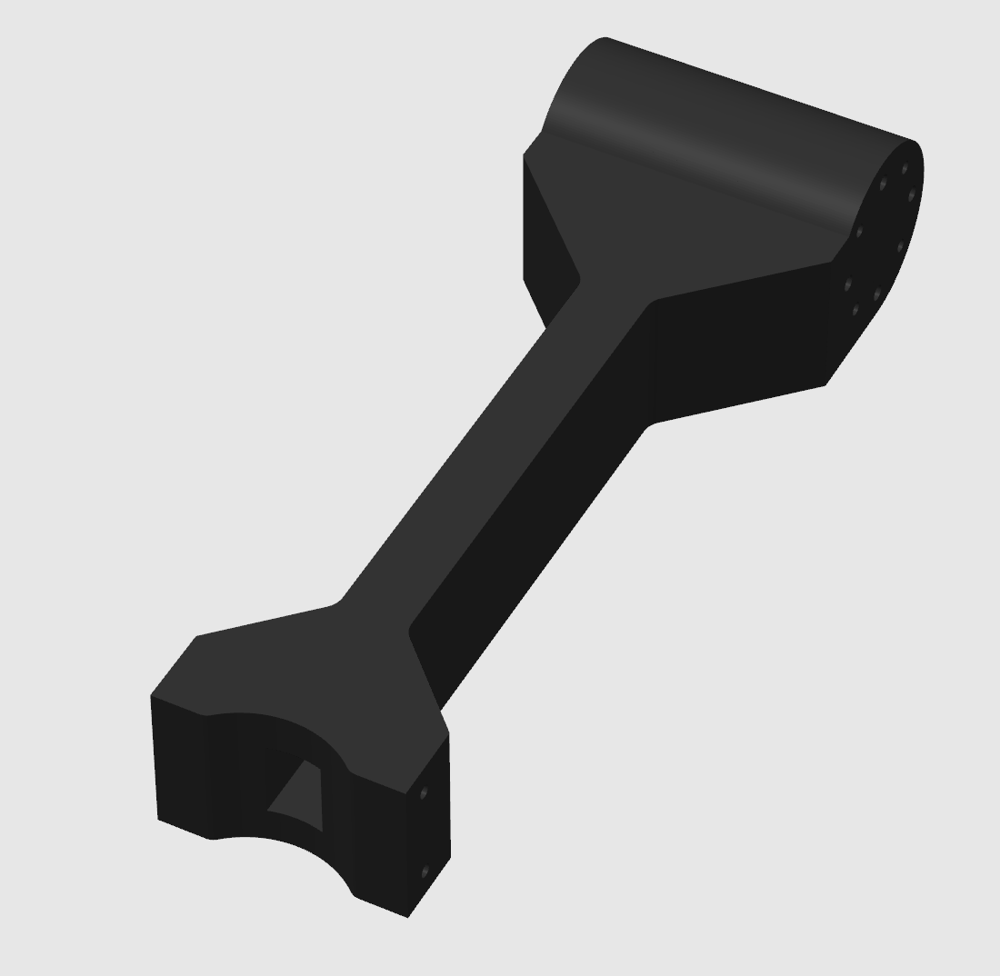 | 01_Lower_Arm_Filler_M.step | Bambu ABS Black | 1 | 0.4mmノズル、0.2mmレイヤー高さ、30%インフィル |
| 上アームカバー | 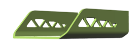 | 01_Upper_Arm_Cover.step | Bambu PLA Green | 1 | 0.4mmノズル、0.2mmレイヤー高さ、15%インフィル |
| 下アームカバー | 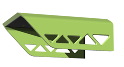 | 01_Lower_Arm_Cover.step | Bambu PLA Green | 1 | 0.4mmノズル、0.2mmレイヤー高さ、15%インフィル |
| モーター5保護カバー | 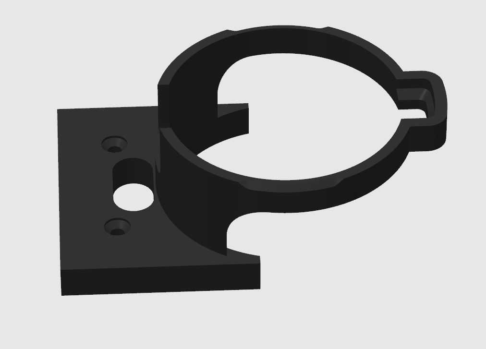 | 01_Motor_Cover.step | Bambu ABS Black | 1 | 0.4mmノズル、0.2mmレイヤー高さ、30%インフィル |
| グリッパー水平リミット | 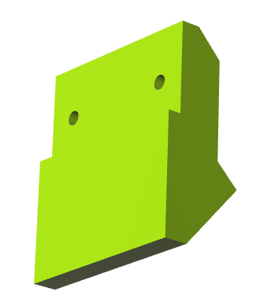 | 01_Lower_Arm_Limit.step | Bambu PLA Green | 1 | 0.4mmノズル、0.2mmレイヤー高さ、15%インフィル |
| グリッパースライダーサポートブラケット | 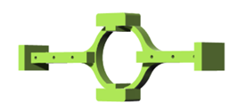 | 01-Rail-Bracket.step | Bambu PLA Green | 1 | 0.4mmノズル、0.2mmレイヤー高さ、15%インフィル |
| グリッパーフィンガー | 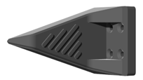 | 01_Finger.step | Bambu ABS Black | 2 | 0.4mmノズル、0.2mmレイヤー高さ、45%インフィル |
| モーター5 ケーブル拘束 |  | 01_Joint5_Cable Restraint_A.step | Bambu PLA Green | 1 | 0.4mmノズル、0.2mmレイヤー高さ、15%インフィル |
| モーター6＆7 ケーブル拘束 A |  | 01_Joint6_7_Cable Restraint_A.step | Bambu ABS Black | 2 | 0.4mmノズル、0.2mmレイヤー高さ、30%インフィル |
| モーター6＆7 ケーブル拘束 B |  | 01_Joint6_7_Cable Restraint_B.step | Bambu ABS Black | 2 | 0.4mmノズル、0.2mmレイヤー高さ、30%インフィル |
| - | 参考価格 | 平均 **50$** | | | 材料費と印刷時間により価格変動 |

## 📷 対応カメラマウント

| 部品説明 | 画像 | ファイル名 | 材料 | 数量 | 注記 |
|----------|------|--------|------|----------|------|
| [Orbbec Gemini2](https://www.seeedstudio.com/Orbbec-Gemini-2-3D-Camera-p-6464.html) | 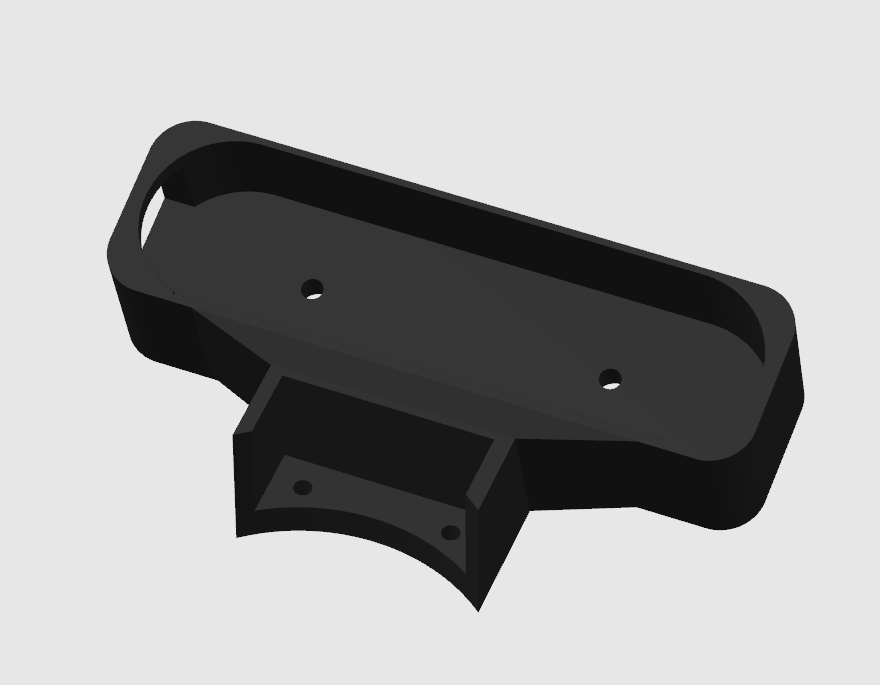 | Gemini2_mount.step | Bambu ABS Black | 1 | 0.4mmノズル、0.2mmレイヤー高さ、30%インフィル |

### 🧩 印刷推奨事項
- レイヤー高さ: 0.2 mm
- ノズル: 0.4 mm
- サポート: 必要に応じて追加
- 材料: 高温・耐荷重部品にはABS（インフィル30～80%）、ナイロンまたはカーボン繊維強化材料も可。外装部品にはPLA（インフィル15%）。
- 耐荷重部品の推奨材料：

---

## 🔩 CNC加工金属部品

> [!WARNING]
> 注記に記載されている一部の部品は3Dプリントに置き換え可能で、コストを大幅に削減できます。

| 部品説明 | 画像 | ファイル名 | 材料 | 数量 | 加工 | 注記 |
|----------|------|--------|----------|------|------|------|
| モーター1 ベアリングマウント | 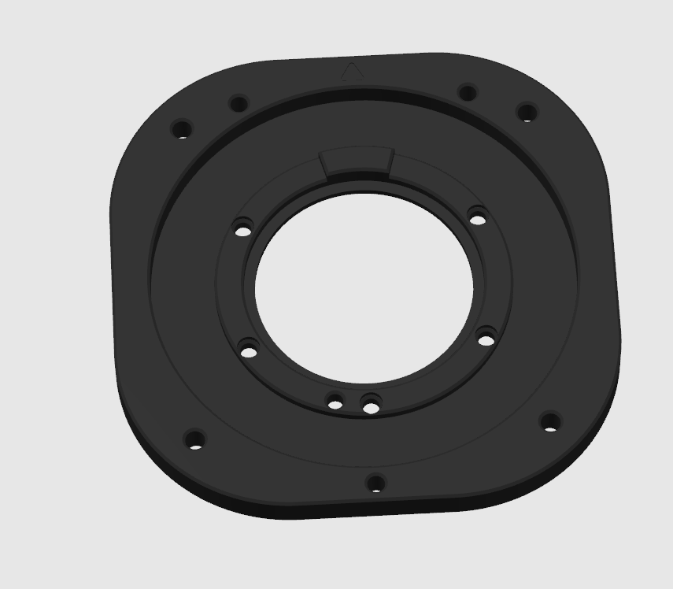 | 02_Base_Reinforcement_Part.step | アルミニウム合金 5052 | 1 | CNC | コスト削減のため、高インフィルABSで3Dプリント可能 |
| モーター1 回転軸 | 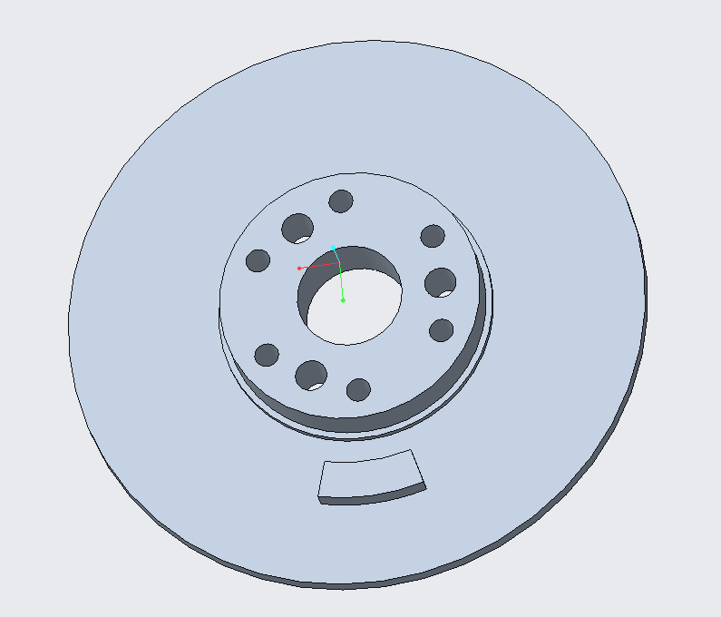 | 02_Arm_Yaw_Limit.step | アルミニウム合金 5052 | 1 | CNC | ヨー角運動制限を追加 |
| モーター2–5 フロントスペーサー | 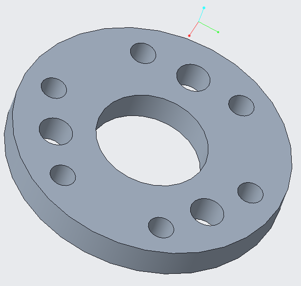 | 02_Motor_Front_Spacer.step | アルミニウム合金 5052 | 4 | CNC | ABS、インフィル30%で3Dプリント可能 |
| モーター2–4 リアスペーサー | 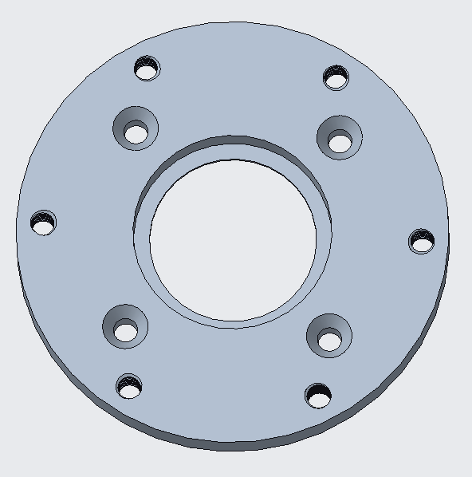 | 02_Motor_Back_Spacer.step | アルミニウム合金 5052 | 3 | CNC | |
| モーター2–4 リアフランジ | 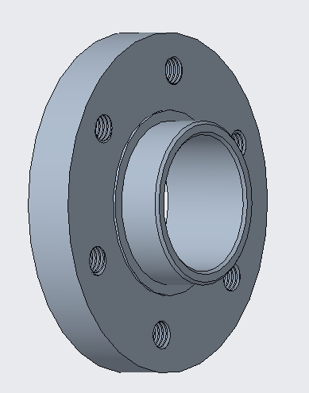 | 02_FLANGE.step | アルミニウム合金 5052 | 3 | CNC | |
| 手首モーター5 ブラケット | 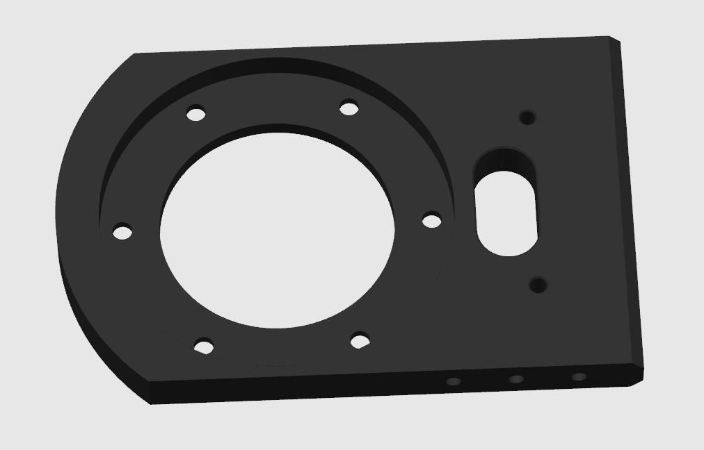 | 02_Wrist_Bracket.step | アルミニウム合金 5052 | 1 | CNC | |
| グリッパーコネクタ A | 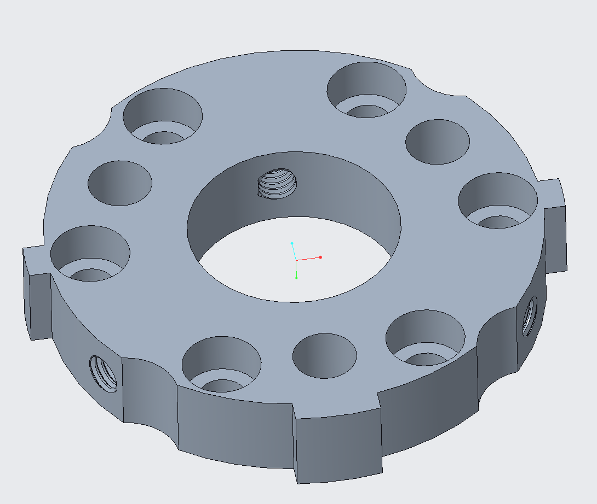 | 02_Gripper_Connector_A.step | アルミニウム合金 5052 | 1 | CNC | |
| グリッパーコネクタ B | 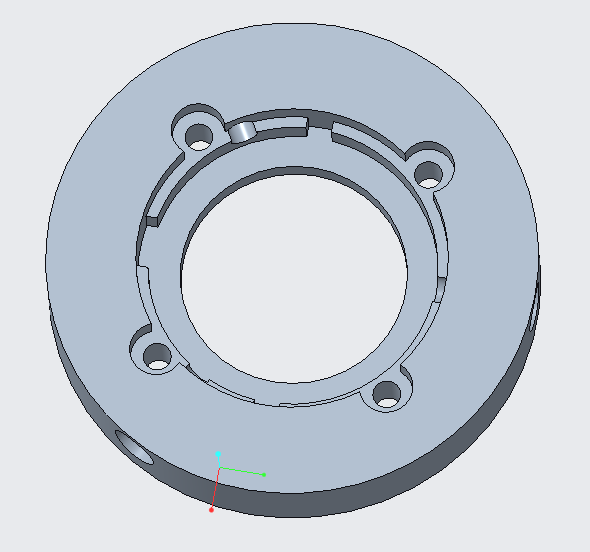 | 02_Gripper_Connector_B.step | アルミニウム合金 5052 | 1 | CNC | |
| グリッパースライダー金属ブラケット | 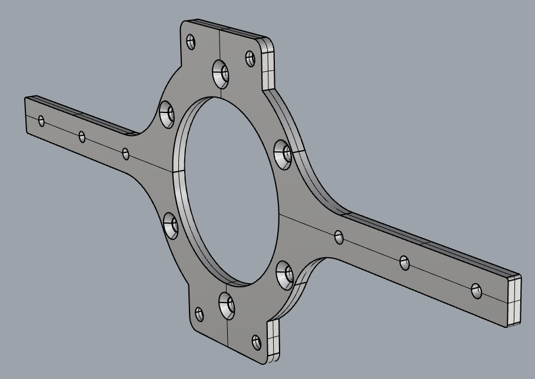 | 02_Slider_Bracket.step | アルミニウム合金 5052 | 1 | CNC | 高インフィルABSで3Dプリント可能だが、長期使用は非推奨 |
| スライダーからグリッパーへの延長部 | 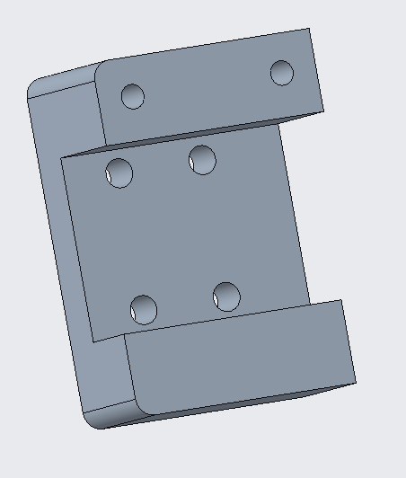 | 02_Slider_Extension.step | アルミニウム合金 5052 | 2 | CNC | |
| 上下アームリンク左 | 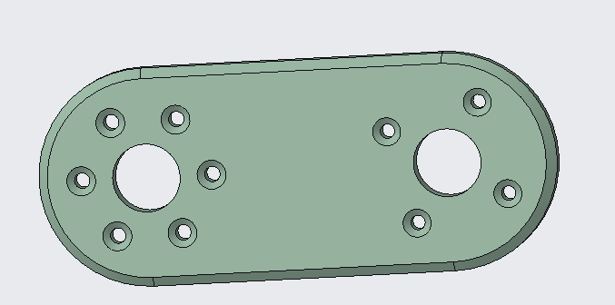 | 02_Lower_Upper_Link_L.step | アルミニウム合金 5052 | 1 | CNC | |
| 上下アームリンク右 | 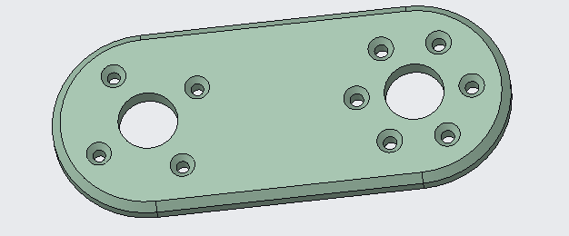 | 02_Lower_Upper_Link_R.step | アルミニウム合金 5052 | 1 | CNC | |
| 下アーム-手首リンク左 | 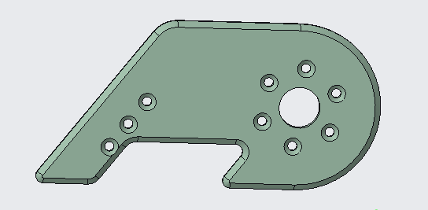 | 02_Lower_Wrist_Link_L.step | アルミニウム合金 5052 | 1 | CNC | |
| 下アーム-手首リンク右 | 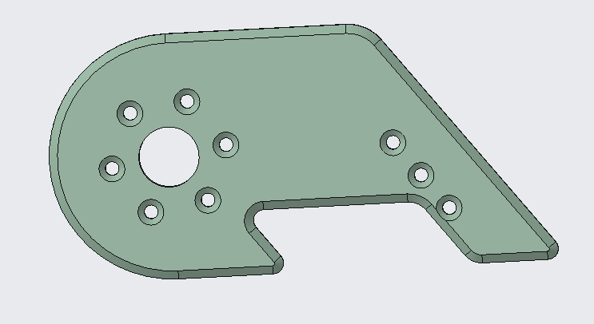 | 02_Lower_Wrist_Link_R.step | アルミニウム合金 5052 | 1 | CNC | |
| ギアコネクタ | 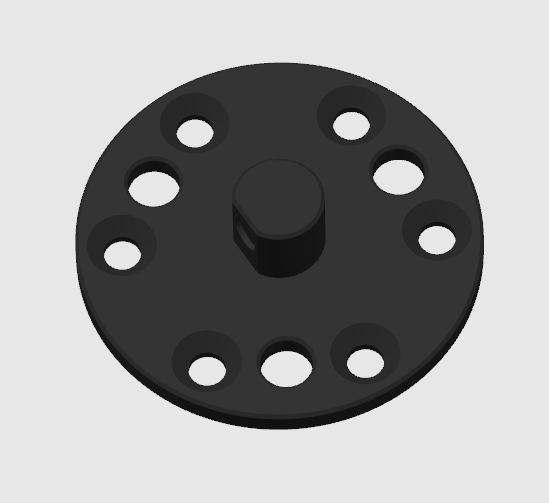 | 02_Gear_Connector.step | アルミニウム合金 5052 | 1 | CNC | |
| ラック | 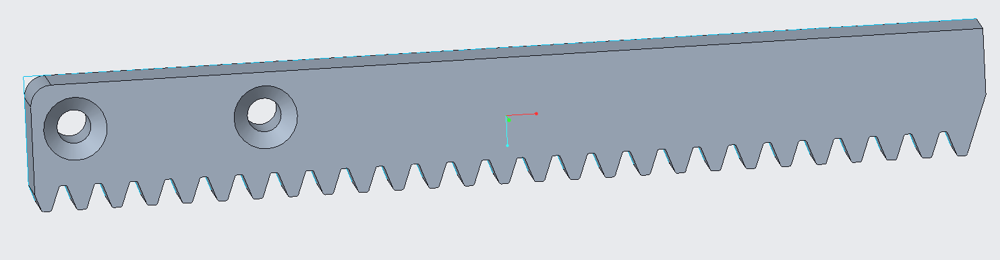 | 02_Rack.step | アルミニウム合金 5052 | 2 | CNC | |
| リンク 1 | 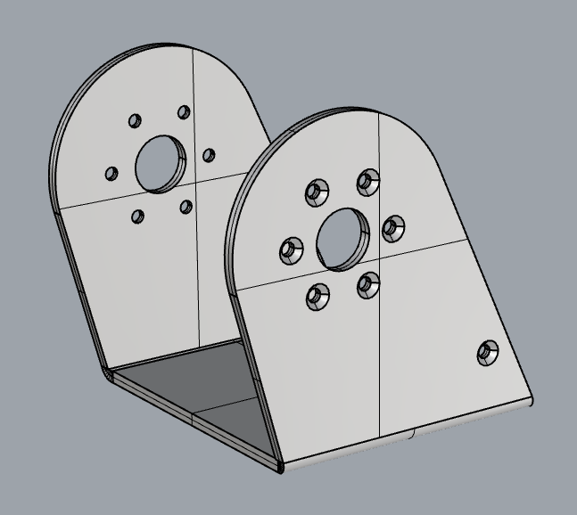 | 03_Link1.step | アルミニウム合金 5052 | 1 | CNC + 板金 | |
| リンク 2 | 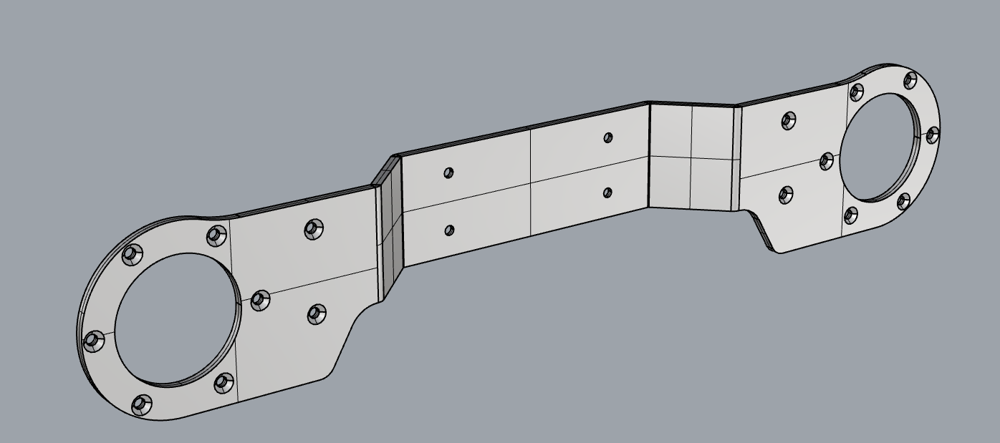 | 03_Link2.step | アルミニウム合金 5052 | 2 | CNC + 板金 | |
| リンク 3 左 | 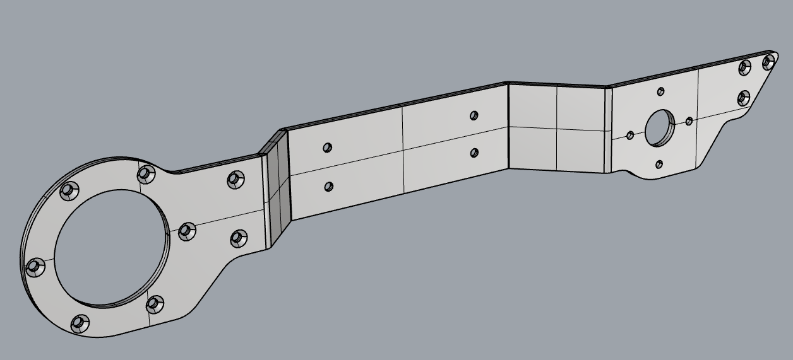 | 03_Link3_L.step | アルミニウム合金 5052 | 1 | CNC + 板金 | |
| リンク 3 右 | 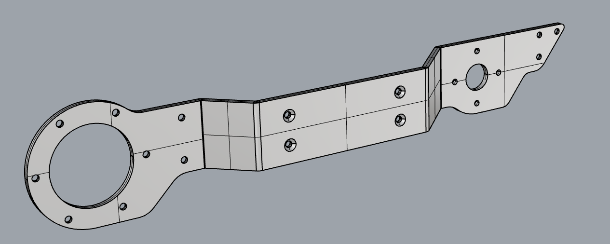 | 03_Link3_R.step | アルミニウム合金 5052 | 1 | CNC + 板金 | |
| リンク 5 | 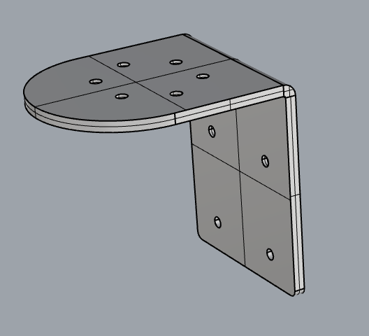 | 03_Link5.step | アルミニウム合金 5052 | 1 | CNC + 板金 | |
| - | 市場参考価格 | 平均 **250$** | | | アルミニウムコスト、公差要件、納期により価格変動 |

### 🧩 加工仕様
- 主要寸法公差: ±0.02 mm GB/T1840-M
- 表面仕上げ: アルマイト / サンドブラスト
- 嵌合部品推奨: H7 / インターフェリンスフィット
---

## 🛒 購入部品 (標準部品)

> [!WARNING]
> 組み立て・ネジ締めはご自身で行っていただく必要があるため、標準的な六角穴付きネジを選択しています。長時間の動作後、ネジが緩み、ロボットアームの精度に影響を与える可能性があります。そのため、各ジョイントのネジにネジロックを行うためのホットメルト接着剤を別途購入する必要があります。

電動ドリルなどの工具をお持ちの場合は、代わりにロックワッシャーやネジロック剤付きネジを購入しても構いません。ただし、電動ドライバーを使用する際は**非常に重要なこと**ですが、ネジ山をなめないように最も低いトルク設定を使用してください。ネジ山をなめると、元に戻せない損傷が発生します。

| 名前 | 仕様 / モデル | 数量 | 参考価格 | 注記 |
|------|----------|------|----------|------|
| ブラシレスモーター | DM4310(V4) | 4 | 120 $/unit | [SeeedStudio](https://www.seeedstudio.com/DIP-Servo-Motor-24V-120RPM-Brushless-98-9mm-4P-L56-W56-H46mm-p-6660.html) |
| ブラシレスモーター | DM4340P(V4) | 3 | 175 $/unit | [SeeedStudio](https://www.seeedstudio.com/DM4340P-Actuator-p-6663.html) |
| CAN-USBドライバーボード | | 1 | 15 $/unit | [SeeedStudio](https://www.seeedstudio.com/DM-CAN-USB-Driver-Borad-p-6706.html) |
| ベアリング | 6707ZZ | 1 | 13 $/unit | [Amazon](https://www.amazon.com/uxcell-35x44x5mm-Shielded-Precision-Lubricated/dp/B0D6WBMW3F/ref=sr_1_1) |
| ベアリング | 6803ZZ | 3 | 13 $/unit | [Amazon](https://www.amazon.com/uxcell-17x26x5mm-Shielded-Precision-Lubricated/dp/B0D54JSWBZ/ref=sr_1_1) |
| ベアリング | AXK5578 | 1 | 12 $/unit | [Amazon](https://www.amazon.com/PZRT-AXK5578-Thrust-Bearings-Washers/dp/B0B3M3RZGW/ref=sr_1_1) |
| リニアレール | MGN9-170mm | 1 | 23 $/unit | [Amazon](https://www.amazon.com/uxcell-Sliding-Carriage-Bearing-Printers/dp/B0D54L45WM/ref=sr_1_1) |
| スライダーブロック | MGN9 | 2 | 10 $/unit | [Amazon](https://www.amazon.com/uxcell-Bearing-Sliding-Carriage-Anti-Fall/dp/B0D9QBQDKB/ref=sr_1_8) |
| ギア | モジュール1、ボス型、16歯、ボア6mm | 1 | 44$/unit | [Amazon](https://www.amazon.com/Module-15-Teeth-Finished-Perforation/dp/B0GDSR1LKM/ref=sr_1_1) |
| シリコンパッド | 30x9x2mm | 1 | 10 $ | [Amazon](https://www.amazon.com/Self-Adhesive-Anti-Sliding-Anti-Scratch-Protectors-Appliances/dp/B0F9KVYXFZ/ref=sr_1_3) |
| ネジ | HM3-12mm ネジ | 14+ | | [Amazon](https://www.amazon.com/BNUOK-120pcs-Stainless-Threads-Spanner/dp/B0DJQGMQZM/ref=sr_1_4) |
| ネジ | HM3-25mm ネジ | 14+ | | [Amazon](https://www.amazon.com/BNUOK-120pcs-Stainless-Threads-Spanner/dp/B0DJQFGRPQ/ref=sr_1_4) |
| ネジ | HM3-6mm ネジ | 16+ | | [Amazon](https://www.amazon.com/BNUOK-120pcs-Stainless-Threads-Spanner/dp/B0DJQG5YLF/ref=sr_1_4) |
| ネジ | HM4-75mm 止めネジ | 4+ | | [Amazon](https://www.amazon.com/iexcell-Partially-Threaded-Thread-Socket/dp/B0DR1NX178/ref=sr_1_1) |
| ネジ | KM3*12mm ネジ | 30+ | | [Amazon](https://www.amazon.com/Uxcell-a16011300ux0872-M3x12mm-Carbon-Countersunk/dp/B01E6EIC2S/ref=sr_1_1) |
| ネジ | KM3*16mm ネジ | 34+ | | [Amazon](https://www.amazon.com/Uxcell-a16011300ux0872-M3x12mm-Carbon-Countersunk/dp/B01E6EIC2S/ref=sr_1_1) |
| ネジ | KM3*7mm ネジ | 76+ | | [Amazon](https://www.amazon.com/Uxcell-a16011300ux0872-M3x12mm-Carbon-Countersunk/dp/B01E6EIC2S/ref=sr_1_1) |
| ネジ | KM3*9mm ネジ | 31+ | | [Amazon](https://www.amazon.com/Uxcell-a16011300ux0872-M3x12mm-Carbon-Countersunk/dp/B01E6EIC2S/ref=sr_1_1) |
| ネジ | KM3*8mm マイクロプロファイル六角穴付きネジ | 31+ | | [Amazon](https://www.amazon.com/SMALLRIG-Screw-Screws-12pcs-Pack/dp/B01MS60KSY/ref=sr_1_1) |
| ネジ | KA3*12mm | 72+ | | [Amazon](https://www.amazon.com/uxcell-Phillips-Tapping-Screws-Silver/dp/B01MXSS95N/ref=sr_1_3) |
| 位置決めピン | M4*8mm | 数本 | | [Amazon](https://www.amazon.com/HARFINGTON-Stainless-Cylindrical-Furniture-Installation/dp/B0F6CWL4MP/ref=sr_1_6) |
| 位置決めピン | M4*12mm | 数本 | | [Amazon](https://www.amazon.com/HARFINGTON-Stainless-Cylindrical-Furniture-Installation/dp/B0F6CWL4MP/ref=sr_1_6) |
| ドライバーセット | 六角レンチセット | 1 | 16$ | [Amazon](https://www.amazon.com/Amazon-Basics-Ratcheting-Electronics-Screwdriver/dp/B07V4TFWFZ/ref=sr_1_2) |
| 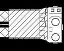 | XT30 2+2 350mm | 2 | 4 $/cable | 両端アングル |
|  | XT30 2+2 350mm | 1 | 4 $/cable | 一端アングル、一端ストレート |
|  | XT30 2+2 200mm | 3 | 4 $/cable | 両端アングル |
|  | XT30 2+2 200mm | 1 | 3 $/cable | 両端ストレート |

### 固定方法について
付属の3Dプリント部品を基に、土台を自由に加工していただけます。机の天板の厚さに合わせて、Gクランプを使用することも可能です。

| 名称 | 仕様/型式 | 数量 | 参考価格 | 備考 |
|------|----------|------|----------|------|
| 木工用クランプ | 6インチ Gクランプ | 2個 | 1個あたり20ドル | [Amazon](https://www.amazon.com/gp/aw/d/B092J1YW2M/?_encoding=UTF8&pd_rd_plhdr=t&aaxitk=3557c048ce58e7dbb50b40c3af69f1d6&hsa_cr_id=0&qid=1774772748&sr=1-1-9e67e56a-6f64-441f-a281-df67fc737124&ref_=sbx_s_sparkle_sbtcd_asin_0_img&pd_rd_w=bNqtC&content-id=amzn1.sym.2fb72bc8-96ef-420d-b08f-c04b69f36507%3Aamzn1.sym.2fb72bc8-96ef-420d-b08f-c04b69f36507&pf_rd_p=2fb72bc8-96ef-420d-b08f-c04b69f36507&pf_rd_r=KDCPNZRHFWEWBWVHWSTR&pd_rd_wg=sBvfF&pd_rd_r=52b946ee-46e2-4e74-86ee-99e291552e44) |

### 電源について
本ロボットアームは標準で電源が付属しておりません。お手持ちのバッテリーを接続するか、台湾製の信頼性の高い**24V 14.6A MeanWell製電源**を別途ご購入ください。
加えて、現地基準に適合した3ピンプラグ、及びXT30メスコネクタ付き配線ハーネスもご用意いただく必要があります。

| 名称 | 仕様/型式 | 数量 | 参考価格 | 備考 |
|------|----------|------|----------|------|
| 電源装置 | 24V 14.6A | 1個 | 30ドル | [Amazon](https://www.amazon.com/MEAN-WELL-LRS-350-24-350-4W-Switchable/dp/B013ETVO12/ref=sr_1_1?crid=2559HZMZF6ZUS&dib=eyJ2IjoiMSJ9.vpZwmjb4m5KMNcsg2Kb7wtfqG-A8US11Eaq0B9JOtKBwPyL6ZyUXh5oUrc5lyVLibya9NQ3n4OUjZ1INKKXLtwJWsRJbA_cPohVKu19q3esXrAY8YFpA4teehMNx3zdrt_WhXZyo1zxQUEHgh558m0vuZ0G1KjW3Rk9LOUVn0olRD-nnyvOwhNycxZqoO9KHkTt4q3kkDNEtn_iAH3x1C6wSv97gxI3nFKhXETsCou11G6_97-PJwk6cEkm2aOT2Yg-xm-uYfNMg85_QRFEDdsY-yeC_8n55d_auTSqqc38.SwYH_qOo0fEt9xkz_H6RWeZ78kxrOs9QKhGEKhmfRBs&dib_tag=se&keywords=Power+supply+24V+14.6A&qid=1774772552&s=industrial&sprefix=power+supply+24v+14.6a%2Cindustrial%2C333&sr=1-1) |
| 電源ケーブル | 12AWG | 1本 | 30ドル | [Amazon](https://www.amazon.com/Pinfox-Universal-Appliance-Replacement-Pigtail/dp/B0F5PW5SJG/ref=sr_1_6?crid=1EIU51YZCRLT9&dib=eyJ2IjoiMSJ9.SAX2wYEran7eecwu4SDFfugT8z0m8kjFOv972WAv1aoYMTB-us_RgARfoKz3G9hpFqw3p4dtTfzyPzH-pQoitReEJ_DMB-xmLUg3nA3uRNNmYF9Zl9d9iX6yCcU6lCpE_GL9-oqRlTC4A2t1--_88yskpiLLBpx50I08Ze8ql2L6fVikg6k6wx6rTvhpLEHZHqDyITCApEDPPygOu4x8BkY68RpMAM1_Fsd_1M-GMb0YlT2p2u6ywbO08KJg0c3QMfTApauxKjB5INgnxKV9EspudalX0FbQUF1DBc8Fh7s.jtylu4ii8VEhu1FJG6P7h6vw5M7rNci4iQPj8IhOfr8&dib_tag=se&keywords=Power%2BCable&qid=1774772590&s=industrial&sprefix=power%2Bcab%2Cindustrial%2C413&sr=1-6&th=1) |
| 電源ケーブル | XT30 16AWG | 1本 | 9ドル | [Amazon](https://www.amazon.com/RioRand-Connector-Pigtail-Silicone-Aircraft/dp/B0FY2ZCR83/ref=sr_1_8?crid=1I8XB5AF5YIPA&dib=eyJ2IjoiMSJ9.8Cx4Olln9I8dGnZGL6MRb6AdEsUY70emHKd_NuuvYCBdrZWbUbSmWDDnYirfmFQVEexy0_clLKn2bi2DcGzjf_OEu1RM9j71jZ0-eL2Hgr0AOzFRl06OY7dQE0eMIXesWqJhHUkUoQFTA6EIegYoIUURzHkZAbT3CZyTpQoWYHOfVECyAsKDsKLoekybImOwDe1X9Ub4vawG56Ov7nBLWXf81DpwV-bH9H0kM1jTJaacHHII9eFWdd-50tChIRSI6Ld0kUIvOqbWOWHMshFgK7lHSa76icMJwJOZaruti0c.erWlQgcCcuEDYLFVqRIp7CpmiONST0SMW8W1OT-OnMg&dib_tag=se&keywords=XT30%2B14awg&qid=1774772667&s=industrial&sprefix=xt30%2B14a%2Cindustrial%2C350&sr=1-8&th=1) |

---